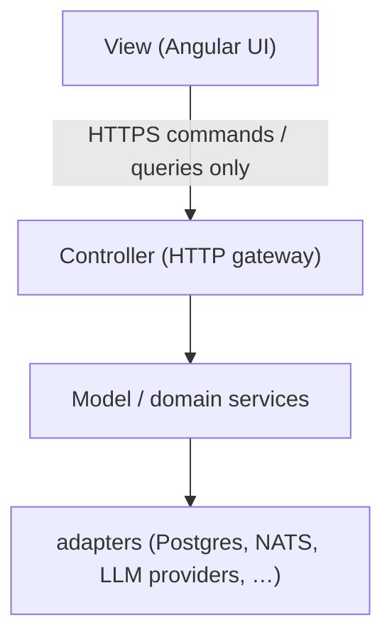

# MVC and Isolation for CloudBSD Applications

CloudBSD applications separate presentation, control, and domain logic. A web UI presents state and sends messages. It does not own business rules, secrets, or data stores.

## 1. Layers

- **View**: Render what the backend already decided. Collect user input. Pass commands and queries to the controller. No provider API keys, no direct database or queue access, no failover or quota logic in the browser.
- **Controller**: Authenticate, authorize, validate, translate HTTP into domain operations, return DTOs the view can render. Keep it thin.
- **Model**: Bots, jobs, users, provider policy, recovery/fallback. This is the only place those rules live.
- **Adapters**: Talk to Postgres, NATS, Ollama, Anthropic, and so on. The view never imports these.

Do not collapse view and model into one process that the public internet can call as "the app."

## 2. Public surface

By default, **backends are not publicly accessible**.

- Bind application servers (gateways, workers, conductors, databases, queues) to `127.0.0.1` or a private mesh (WireGuard, jails, RFC1918). Not `0.0.0.0` on a public interface.
- The public listener is the TLS terminator in front of the **view** (Caddy, nginx, or equivalent) on 443. It reverse-proxies to the controller on loopback.
- **Exception:** you may expose a backend to the network only when you are deliberately publishing an API. That API must be authenticated, versioned, rate-limited, and documented as public. "The SPA needs it" is not a public API.
- Workers, schedulers, and data stores are never the public API.

## 3. Messages, not shared memory

The view talks to the controller over HTTP(S) (and SSE/WebSocket when streaming). It does not share process memory, Unix sockets from the browser, or service-mesh credentials.

Commands are explicit (create bot, send chat, refresh models). Queries are explicit (list bots, job status). The view does not embed SQL, NATS subjects, or provider URLs.

## 3.1 Re-wrap everything

Even when the backend is "just a proxy" to Ollama, Anthropic, or another LLM, **it still re-wraps every payload**.

- The browser never speaks a provider protocol. Not OpenAI `/v1/chat/completions`, not Anthropic Messages, not Ollama `/api/chat`, not raw provider SSE.
- Adapters translate inbound provider data into **application DTOs** (chat events, model lists, jobs, errors). The controller returns only those types.
- Streaming is the application's own event stream. Do not reverse-proxy a provider's byte stream to the client.
- Provider URLs, API keys, request IDs, and native error bodies stay on the server. The view gets a stable app error (`provider_exhausted`, `unauthorized`, `invalid_prompt`), not a dumped upstream JSON.
- A public API, when you deliberately expose one, is still *your* API. Wrapping does not stop at the UI.

Pass-through is not isolation.

## 4. Isolation checks

Before shipping:

- Browser bundles contain no secrets and no provider base URLs used for server-side calls.
- `listen` addresses for non-UI processes are loopback or mesh-only in example config.
- A user who can open the UI still cannot reach Postgres, NATS, or workers without going through the controller.
- Tests cover: unauthenticated API denied; UI origin cannot call provider adapters directly.
