# Chapter 3: Document Structure

**Document ID:** PLANNING-001-03
**Chapter:** 3 of 10
**Last Updated:** 2026-05-02

---

## 3.0 Required Header and Footer

### 3.0.1 Document Header Block

Each document must begin with a header block:

```markdown
# <Document Title>

**Document ID:** <Unique-ID>
**Version:** <Version-Number>
**Last Updated:** <YYYY-MM-DD>
**Maintainer:** <Team or Contact>
**Status:** DRAFT | ACTIVE | STALE | DEPRECATED
**Classification:** INTERNAL | CONFIDENTIAL | PUBLIC

---

## Table of Contents
1.0.0  ...
1.0.1  ...
```

### 3.0.2 Document Footer Block

Each document must end with a change log and footer:

```markdown
---

## Change Log

| Version | Date | Author | Changes |
|---------|------|--------|---------|
| 1.0 | YYYY-MM-DD | Name | Initial version |

**Last Updated:** YYYY-MM-DD HH:MM UTC
**Contact:** maintainer@example.com
**Classification:** INTERNAL
```

---

## 3.1 Table of Contents (`000`)

The TOC must include:

- A document map table with file, title, status, and description
- A dependency graph showing relationships between documents
- A recommended reading order for new contributors
- A cross-reference index for topics that span multiple documents
- Build status summary (linking to `0002-<Project>-Build-Status.md`)

### 3.1.1 Document Dependencies Tree

Use a Mermaid graph to show document relationships:

```markdown
## Document Dependencies
```



```mermaid
flowchart TD
    TOC["0000 TOC"]
    WF["0001 Workflow"]
    BS["0002 Build Status"]
    SEC["0100 Security Overview"]
    OV["0200 Overview"]
    IMP["0300 Implementation Tasks"]
    TEST["0400 Testing"]
    GOV["0500 Governance"]

    TOC --> WF
    TOC --> BS
    TOC --> SEC
    SEC --> TM["0101 Threat Model"]
    SEC --> AC["0102 Access Control"]
    SEC --> ES["0103 Emulator Security"]
    SEC --> RS["0104 Runtime Safety"]
    SEC --> AA["0105 Additional Analysis"]
    SEC --> SI["0106 Security Implementation"]
    TOC --> OV
    OV --> CA["0201 Current Architecture"]
    OV --> AD["0210 Architecture Design"]
    TOC --> IMP
    IMP --> KM["0301 Kernel Module"]
    IMP --> UT["0302 Userland Tools"]
    TOC --> TEST
    TEST --> UNIT["0401 Unit Tests"]
    TEST --> INT["0402 Integration Tests"]
    TEST --> CV["0403 Code Validation"]
    TOC --> GOV
    GOV --> SYS["0501 Sysctl Interface"]
    GOV --> TOOL["0510 Tooling"]
    GOV --> EX["0511 Examples"]
```

### 3.1.2 Reading Order

Provide a numbered reading sequence for new contributors:

```markdown
## Reading Order for New Contributors

1. `AGENTS.md` — Start here (project root auto-load). Claude Code: `CLAUDE.md` → `@AGENTS.md`.
2. `0000-<Project>-TOC.md` — Master index
3. `0001-<Project>-Workflow.md` — How tasks work
4. `0100-<Project>-Security-Overview.md` — Security strategy
5. `0200-<Project>-Overview.md` — The big picture
6. `0300-<Project>-Implementation-Tasks.md` — What needs building
7. `0400-<Project>-Testing.md` — How to verify
8. `0500-<Project>-Governance.md` — Operational policies
```

---

## 3.2 Workflow (`001`)

The workflow document must define:

- How to select and claim tasks
- The task table format (see Chapter 4)
- Commit and push requirements after claiming and completing
- How to handle blocked or impossible tasks
- Merge conflict resolution for multi-agent scenarios
- Agent identity and hostname conventions
- Communication protocols for multi-agent coordination

### 3.2.1 Multi-Agent Coordination

When multiple agents work concurrently on shared branches:

**Independent vs Dependent Tasks:**
| Type | Description | Coordination |
|------|-------------|--------------|
| Independent | No shared files or dependencies | Work concurrently without locks |
| Dependent | Shared files or sequential dependencies | Use task claiming protocol |

**Sync Protocol:**
1. Before starting, pull latest: `git pull --rebase`
2. Claim tasks by updating status and pushing immediately
3. After completing, push and notify in commit message
4. If blocked by unmerged work, claim next available independent task

**Merge Conflict Resolution:**
1. If conflict detected, stop and assess
2. Communicate via commit message or log
3. The agent with the merge conflict should either:
   - Resolve immediately if changes are minor
   - Revert and rebase if changes are substantial
   - Mark task as `🟡 BLOCKED` and pick another task

### 3.2.2 YOLO Mode

For autonomous operation without human confirmation:

```markdown
## YOLO Mode

**YOLO Mode:** Enabled (skip all confirmations)

When YOLO mode is active:
- Agents skip confirmation prompts for task claims and completions
- Agents proceed with autonomous decision-making
- All actions still require immediate git commit and push
- Conflicts are resolved autonomously with revert/rebase strategy
```

**Enabling YOLO Mode:**
YOLO mode is typically set via environment variable or agent configuration. When enabled, the agent displays a visual indicator in all outputs.

**When to Use YOLO:**
- During overnight autonomous sessions
- When human review will happen later
- For well-defined, low-risk tasks

**When to Disable YOLO:**
- When making architectural decisions
- When modifying shared critical files
- When uncertain about task scope

---

## 3.3 Overview (`200`)

The overview document (200) must cover:

- Executive summary and motivation
- Problem statement and target use cases
- High-level architecture with Mermaid diagrams
- Supported platforms or configurations
- Implementation phases with milestones
- Risk assessment summary
- Success criteria and Definition of Done

## 3.4 Current Architecture Analysis (`201`)

This document (201) analyzes the existing system (if applicable):

- Current component inventory
- Bottleneck identification
- Migration path from current to target state
- Technical debt assessment
- Constraints and assumptions

## 3.5 Architecture Design (`210`)

The architecture document (210) provides detailed solution design:

- Mermaid architecture diagrams (`` ```mermaid `` fences); never ASCII art
- Component interactions and data flow
- Interface specifications
- State machines for complex components
- Resource governance design
- Failure modes and recovery strategies

---

## 3.6 Security Documents (`100` - `106`)

Security is a **MANDATORY** first-class concern in all CloudBSD projects. The security documentation series provides comprehensive coverage:

### 3.6.1 Security Overview (`100`)

Summary document linking all security documents:

```markdown
# <Project> — Security Overview

**Topics:**
- Security strategy summary
- Links to all security documents (101-106)
- Key security principles
```

### 3.6.2 Threat Model & Isolation (`101`)

```markdown
# <Project> — Security Threat Model

**Topics:**
- Executive summary of security approach
- Assets to protect (host kernel memory, userspace, filesystem, network)
- Threat categories (escape, injection, corruption, exhaustion)
- Trust model (trust levels T0-T4)
- Isolation architecture comparison (bhyve vs custom emulator)
- Process-level and multi-instance isolation
```

### 3.6.3 Access Control & Authorization (`102`)

```markdown
# <Project> — Security Access Control

**Topics:**
- Group configuration (GID_EMU) delegation
- Ownership model (per-instance ucred)
- Granular permissions (macro and micro levels)
- Privilege definitions (PRIV_EMU_*)
- Permission matrix (who can do what)
- Sysctl interface for access control
- Jail integration with emulation flags
- Resource limits per user/group
```

### 3.6.4 Custom Emulator Security (`103`)

```markdown
# <Project> — Security Emulator

**Topics:**
- Attack surface analysis
- Instruction decoder safety (bounds checking, length limits)
- Memory safety (bounds-checked access, overflow detection)
- ELF loader validation (magic, endianness, segment bounds)
- Capsicum sandboxing architecture
- Timing side-channel mitigations
- Resource accounting and rctl integration
```

### 3.6.5 Filesystem, Devices & Crash Safety (`104`)

```markdown
# <Project> — Security Runtime

**Topics:**
- Filesystem security (path validation, symlink escape prevention, TOCTOU)
- Device attack surface (MMIO, UART, virtio-*)
- Network isolation modes (host-only, NAT, bridge)
- Crash containment (detection, state capture, graceful termination)
- Core dump prevention
```

### 3.6.6 Additional Security Analysis (`105`)

```markdown
# <Project> — Security Additional Analysis

**Topics:**
- Audit logging (syslog + file, event definitions)
- MAC framework integration (label propagation)
- Securelevel integration
- Memory scrubbing on instance destroy
- ptrace attack prevention
- TOCTOU race condition prevention
- Signal handling security
- OOM killer interaction
- Entropy/RNG (virtio-rng)
- Supply chain security
- Firmware verification
```

### 3.6.7 Security Implementation Tasks (`106`)

```markdown
# <Project> — Security Implementation Tasks

**Topics:**
- Security recommendations summary
- Implementation phases (S0-Sn) with task tables
- Each task: ID, description, owner, status, files, verification
- Detailed implementation checklist
```

---

## 3.7 Implementation Tasks (`300`)

The implementation document (300) contains the phased task breakdown:

- Phase structure (e.g., Phase 1: Kernel, Phase 1.5: Auto-scaling, Phase 2: Userland)
- Task tables with dependencies, status, and file assignments
- Milestone definitions
- Integration checkpoints

## 3.8 Component Implementation (`301-302`)

Detailed implementation specs for individual components:

- `301-<Project>-Kernel-Module.md` — Kernel-level implementation
- `302-<Project>-Userland-Tools.md` — Userland tools and utilities

---

## 3.9 Testing (`400-403`)

### 3.9.1 Testing Overview (`400`)

Overview of complete testing approach:

- Testing philosophy and principles
- Test pyramid (unit, integration, system, stress)
- Test environment requirements
- Test automation strategy
- Quality gates and exit criteria

### 3.9.2 Unit Tests (`401`)

Defines the isolation testing strategy for core logic:

- **Testing Scope**: Core logic identification, boundary analysis
- **Mocking Strategy**: Dependency isolation, stub implementation
- **Validation Metrics**: Coverage as close to 100% as possible (critical paths 100%), regression testing
- **Environment**: Runner requirements (atf, pytest, etc.)

### 3.9.3 Integration Tests (`402`)

Defines how components work together:

- **End-to-End Scenarios**: Full lifecycle, inter-component workflows
- **Performance and Stress**: Load testing, resource consumption, longevity
- **Network and Environment**: Topology, external dependencies

### 3.9.4 Code Validation (`403`)

Defines the final quality gate and security posture:

- **Static Analysis**: Linting rules, security scanning
- **Dynamic Analysis**: Memory safety (ASAN/MSAN), concurrency (TSAN)
- **Security Audit**: Attack surface mapping, fuzzing strategy
- **Compliance**: CloudBSD standards, license compliance

---

## 3.10 Operations (`500-501`)

### 3.10.1 Governance (`500`)

Defines operational policies:

- Auto-scaling rules and thresholds
- Resource quota management
- Session lifecycle management
- Health check and failover policies
- Audit logging requirements

### 3.10.2 Sysctl Interface (`501`)

Documents the complete sysctl MIB hierarchy:

```markdown
net.graph.<project>.enable = {0|1}
net.graph.<project>.mode = {roundrobin|hash|leastloaded}
net.graph.<project>.max_workers = <number>
net.graph.<project>.timeout = <seconds>
```

Each sysctl node must document:
- Type (int, string, etc.)
- Default value
- Valid range
- Effect on system behavior

---

## 3.11 Alternative Approaches (`600`)

Documents alternatives considered:

- Problem statement
- Alternative solutions evaluated
- Trade-off analysis matrix
- Rationale for final selection
- Rejected alternatives and reasons

## 3.12 Tooling and Examples (`601-602`)

### 3.12.1 Tooling (`601`)

Management tools and operational scripts:

- CLI commands (e.g., `ngctl` integration)
- Debug and diagnostic procedures
- Operational runbooks

### 3.12.2 Examples (`602`)

Example configurations:

- Minimal working configuration
- Production-grade configuration
- Edge case configurations
- Configuration templates

---

## 3.13 Risks (`700`)

Risk management document with register:

| Risk ID | Description | Probability | Impact | Mitigation | Status |
|---------|-------------|-------------|--------|------------|--------|
| R001 | Kernel panic under load | Low | High | Rate limiting | OPEN |

- Risk categories: Technical, Schedule, Resource, External
- Contingency plans for high-priority risks
- Risk escalation procedures

## 3.14 Future Enhancements (`800`)

Roadmap beyond current phase:

- Planned features with priority
- Technical debt backlog
- Long-term architectural evolution
- Community request backlog

---

## 3.15 Validation (`900`)

The Validation document provides comprehensive validation of all implemented tasks:

### 3.15.1 Validation Report Format

**Header:**
```markdown
# <Project> Validation Report

> **Purpose:** Independent validation of all implemented tasks
> **Validation Method:** Code review, compilation verification, and implementation accuracy check
> **Generated:** YYYY-MM-DD
```

**Validation Status Legend:**
| Status | Meaning |
|--------|---------|
| ✅ Valid | Implementation is correct, complete, and matches task description |
| ❌ Invalid | Implementation has errors, is incomplete, or doesn't match task description |
| ⚠️ Partial | Implementation is partially complete or has minor issues |
| ⏳ Not Started | Task not yet implemented or not yet validated |

**Per-Phase Task Tables:**
```markdown
## Phase S0: <Phase Name>

| # | Task | Status | Assigned To | Validation Status | Validated By | Validation Date | Validation Comments |
|---|------|--------|------------|-------------------|--------------|-----------------|---------------------|
| S0.1 | Implement module entry point | ✅ DONE | freedev002 | ✅ Valid | freedev003 | 2026-04-27 | Verified... |
```

**Validation Summary Table:**
```markdown
## Validation Summary

| Phase | Total Tasks | Valid | Invalid | Partial | Not Started | % Valid (Completed) | % Valid (Overall) |
|-------|-------------|-------|---------|---------|-------------|---------------------|-------------------|
| S0 | 8 | 8 | 0 | 0 | 0 | 100.0% | 100.0% |
| **Total** | **94** | **77** | **0** | **0** | **17** | **100.0%** | **81.9%** |
```

### 3.15.2 Validation Corrections Report Format

If discrepancies are found between implementation and validation:

```markdown
# <Project> — Validation Corrections Report

> **Purpose:** Document discrepancies between implementation plan and validation report
> **Generated:** YYYY-MM-DD
> **Updated:** YYYY-MM-DD HH:MM

## Executive Summary

| Metric | Value |
|--------|-------|
| Total Tasks in Implementation Plan | 188 |
| Tasks Validated as Complete | 188 |
| Tasks NOT STARTED | 0 |
| Implementation Completion Rate | 100% |
```

### 3.15.3 Validation Document Naming

| Document | Naming Convention | Purpose |
|----------|------------------|---------|
| Initial Report | `9XX-<Project>-Validation-Report-YYYY-MM-DD.md` | Phase-by-phase validation |
| Corrections | `9XX.1-<Project>-Validation-Corrections-YYYY-MM-DD.md` | Discrepancy resolution |

---

## 3.16 Testing Framework (`1000`)

Comprehensive test framework documentation:

- Test harness architecture (e.g., C++ `pppoetest` framework)
- Test case categories and organization
- Test execution procedures
- Coverage reporting

## 3.17 Documentation Plan (`1100`)

Defines the strategy for all project-related documentation:

- **User Documentation**: Installation Guide, Configuration Reference, Usage Examples
- **Technical Documentation**: Architecture Overview, Internal API Reference, Design Rationale
- **Maintenance**: Maintenance Guide, Troubleshooting FAQ, Support Matrix

## 3.18 Testing Scope (`1101`)

Detailed test case inventory:

- Test case matrix with ID, category, description, and coverage
- Happy path and error path test cases
- Performance and stress test specifications
- Test case priority classification (P0, P1, P2, P3)
- Requirements traceability matrix

---

## 3.19 Author Policy

All CloudBSD project documents must include an explicit author policy:

```markdown
## Author Policy

**Author:** <Name> <email>
**Co-Authors:** None (unless explicitly approved)
**Sponsorship:** None (unless explicitly stated and recorded)

### Authorship Rules

- **No trailers**: Do not add `Co-authored-by:`, `Sponsored-by:`, or similar trailers
- **No sponsorships**: Do not include funding acknowledgments unless explicitly approved
- **No co-authors**: All commits made solely by the stated author unless approved
- **Attribution**: When modifying another author's work, maintain original authorship and add a change log entry
```

**Rationale:** Prevents authorship creep and ensures clear accountability.