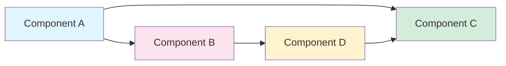
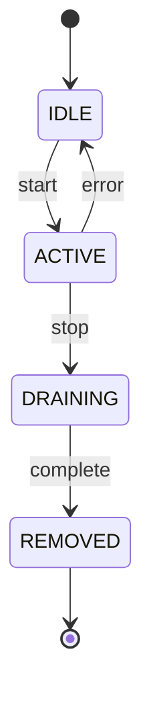

# Chapter 8: Conventions

**Document ID:** PLANNING-001-08
**Chapter:** 8 of 10
**Last Updated:** 2026-05-02

---

## Diagram Conventions

**Mermaid is the preferred drawing methodology** for all CloudBSD documentation diagrams.

Use Mermaid syntax (`` ```mermaid `` code blocks) for all architecture diagrams, state machines, flowcharts, and visual documentation.

### Component Diagram Example



### State Machine Example



---

## Sysctl Interface Conventions

Document sysctl hierarchies using consistent format:

```markdown
### net.graph.<project>

| Node | Type | Default | Range | Description |
|------|------|---------|-------|-------------|
| `net.graph.<project>.enable` | int | 0 | {0,1} | Enable/disable |
| `net.graph.<project>.mode` | int | 0 | {0,1,2} | Algorithm selection |
| `net.graph.<project>.max_workers` | int | 16 | 1-256 | Maximum workers |
```

State enumerations must be documented:

| Value | State | Description |
|-------|-------|-------------|
| 0 | `ACTIVE` | Worker is active |
| 1 | `DRAINING` | Graceful shutdown in progress |
| 2 | `PENDING_REMOVAL` | Marked for removal |