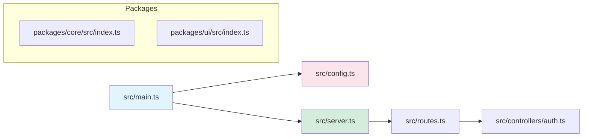
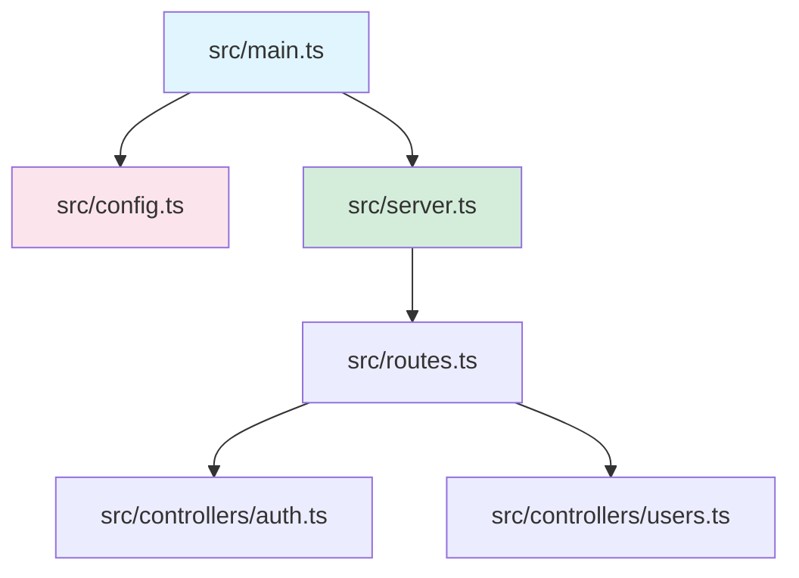
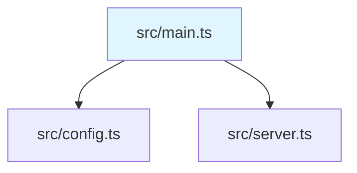
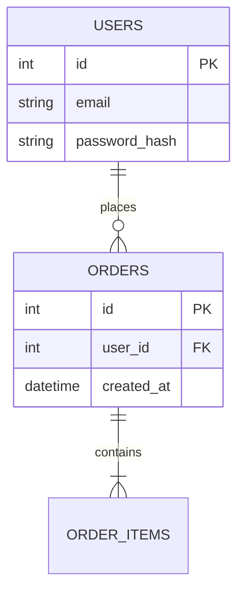
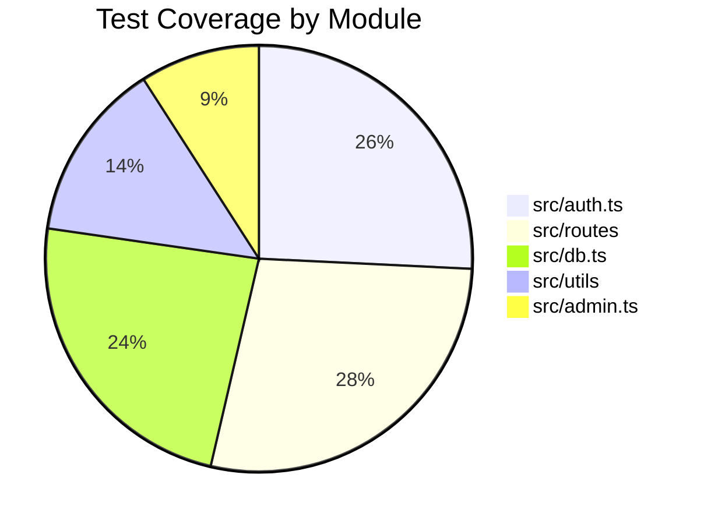
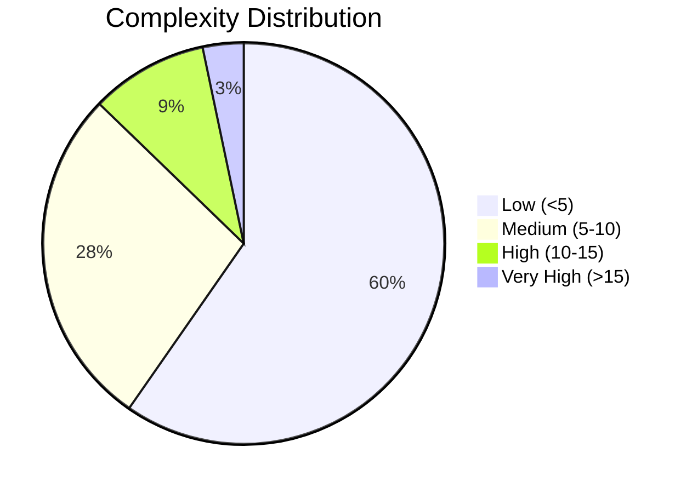
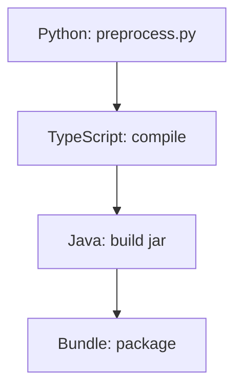
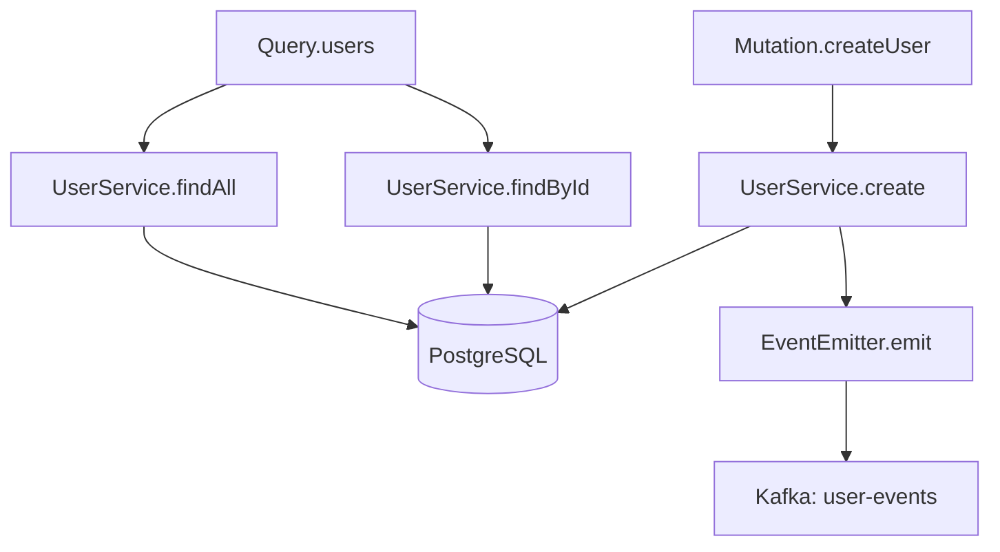
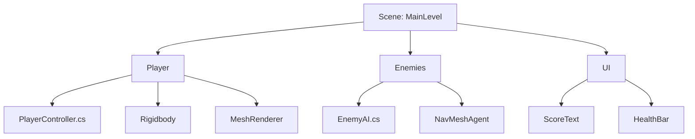
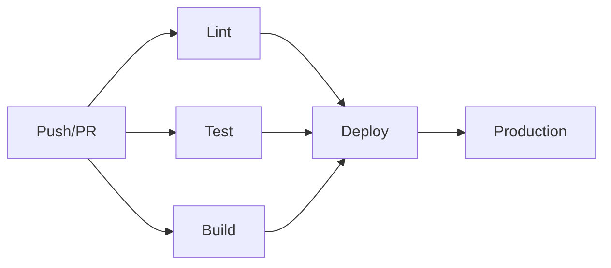

# Codebase Mapper

This skill performs exhaustive, recursive mapping of any codebase into tree-view markdown documents. Every component, file, function, and significant line of code gets its own mapped entry. The output lives in a `.discovery/` directory with a master TOC as the entry point.

## Source Of Truth

The `.discovery/` directory is the single source of truth for codebase understanding. When mapping:

1. Always read the actual file contents before generating tree nodes.
2. Never assume what code does — verify by reading it.
3. If a file imports/requires other files, map those dependencies explicitly.
4. When encountering unfamiliar patterns, read surrounding context before classifying.
5. Prefer answers and descriptions backed by specific source content.

## Guidelines

- **Standards as Law**: This skill's methodology is mandatory, not optional. Every step must be followed.
- **UTF-8 Everywhere**: All generated markdown documents use UTF-8 encoding.
- **One File Per Component**: No single discovery file exceeds ~200 lines of tree content. If a component is large, split it into sub-files.
- **Recursion Has No Depth Limit**: Map as deep as needed. A single line of code can generate 10 tree levels if it involves imports, function calls, object construction, method chains, callbacks, and nested arguments.
- **No Duplication**: Each discovered item maps to exactly one file. Cross-reference via links, never duplicate content.
- **Evidence-Based Descriptions**: Every node description must be backed by what the code actually does, not what you think it should do.
- **Follow Existing Patterns**: When describing components, reference the actual patterns found in the codebase (conventions, naming, architecture).
- **Do NOT modify source code**: This skill only reads and generates discovery documents. Never change the codebase being mapped.
- **Do NOT skip "obvious" items**: Even simple files get mapped. Assumptions about simplicity are the #1 cause of incomplete maps.

## Loading Instructions

Load this skill when the user asks you to:
- Map the codebase
- Create a codebase discovery document
- Generate a tree view of the project structure
- Document what every file and component does
- Create a `.discovery/` directory structure
- Build a codebase map with TOC
- Recursively explore and document the project

## Core Directives (from CloudBSD Application Guidelines)

These directives from the CloudBSD standards govern all mapping behavior:

### Target Platform Awareness
- The codebase being mapped may target any platform. Document the target platform when identified.
- Do not assume the detected environment reflects the real target. Verify via `uname -s`, package managers, config files, and build scripts.
- If the codebase is FreeBSD-targeting (CloudBSD), note this in the root discovery document.

### Security Observations
- When mapping, flag any hardcoded credentials, secrets, or security-relevant patterns.
- Document authentication flows, authorization checks, and input validation points.
- Note least-privilege patterns and privilege escalation paths.

### Configuration Patterns
- Document all configuration file formats and locations discovered.
- Map XDG Base Directory usage if present (`$XDG_CONFIG_HOME`, `$XDG_DATA_HOME`, `$XDG_CACHE_HOME`).
- Map system-wide config paths (e.g., `/usr/local/etc/`, `/etc/`).
- Document environment variable usage for configuration.

### Testing Infrastructure
- Map all test files, test frameworks, and test configurations.
- Document CI/CD pipeline configurations found (GitHub Actions, Jenkins, etc.).
- Note bhyve VM or jail testing patterns if present (FreeBSD-specific).

### Internationalization
- Map all i18n/l10n files, translation directories, and locale configurations.
- Document the i18n framework used (gettext, i18next, etc.).
- Note UTF-8 compliance across source files.

## Mapping Methodology

### Phase0: Entry Point Identification

Identify the starting point of the application:

1. Read `package.json`, `Cargo.toml`, `go.mod`, `pyproject.toml`, `Makefile`, or equivalent to find entry points.
2. Identify the main executable, server entry, CLI entry, or library entry.
3. Read the entry point file completely before proceeding.
4. Create the root discovery document at `.discovery/000-root.md`.

### Phase1: Directory Structure Scan

Generate a high-level tree of the entire project structure:

```
project-root/
├── .discovery/          # Discovery documents (output)
├── src/
│   ├── main.ts          # Entry point → maps to 100-main.md
│   ├── config/          # Configuration module → maps to 200-config/
│   └── server/          # Server module → maps to 300-server/
├── test/
│   └── ...
├── package.json
└── ...
```

Each directory entry in this tree links to its own discovery file.

### Phase1.5: Orphan Discovery (CRITICAL for unlinked files)

Files not in the main dependency chain are easily missed. This phase ensures 100% coverage.

**Step 1: Find ALL project files (excluding standard excludes)**

```bash
# Get ALL files in the project (excluding .discovery/ and common excludes)
find . -type f \
  ! -path "./.discovery/*" \
  ! -path "./node_modules/*" \
  ! -path "./.git/*" \
  ! -path "./dist/*" \
  ! -path "./build/*" \
  ! -path "./.next/*" \
  ! -path "./__pycache__/*" \
  ! -name "*.min.js" \
  ! -name "*.bundle.js" \
  ! -name "*.map" \
  ! -name "*.pyc" \
  > /tmp/all_files.txt

# Count
wc -l /tmp/all_files.txt
```

**Step 2: Extract already-mapped files from .discovery/ documents**

```bash
# Get all files already mapped (extract from .discovery/ documents)
grep -h "**Path:**" .discovery/*.md 2>/dev/null | \
  sed 's/.*`//; s/`.*//' | sort -u > /tmp/mapped_files.txt

# Count mapped
wc -l /tmp/mapped_files.txt
```

**Step 3: Find orphan files (in project but NOT mapped)**

```bash
# Find orphans (in project but not in discovery docs)
comm -23 <(sort /tmp/all_files.txt) <(sort /tmp/mapped_files.txt) > /tmp/orphan_files.txt

echo "=== Orphan Files Found ==="
wc -l /tmp/orphan_files.txt
```

**Step 4: Categorize orphans by type**

```bash
cat /tmp/orphan_files.txt | while read f; do
  if [ -f "$f" ]; then
    lines=$(wc -l < "$f" 2>/dev/null || echo "0")
    ftype=$(file -b "$f" 2>/dev/null || echo "unknown type")
    echo "$f ($lines lines) — $ftype"
  fi
done
```

**Orphan Categories & Handling:**

| Category | Detection | Priority | Action |
|----------|-----------|----------|--------|
| **Entry points** | `main.*`, `index.*`, `cli.*`, `server.*` | 1 | Map immediately with full recursive analysis |
| **Config files** | `.json`, `.yaml`, `.toml`, `.ini`, `.env*`, `Makefile`, `Dockerfile` | 2 | Map to `config-*.md` with full content analysis |
| **Core source** | In `src/`, `lib/`, `app/`, `packages/*/src/` | 3 | Map with full recursive analysis |
| **Test files** | In `test/`, `tests/`, `__tests__/`, `*.test.*`, `*.spec.*` | 4 | Map with test framework identification |
| **Build/CI tooling** | `.github/workflows/*`, `Jenkinsfile`, `docker-compose.yml`, `Makefile` | 5 | Map build steps, dependencies, triggers |
| **Documentation** | `docs/*`, `*.md` (except .discovery/), `README*` | 6 | Map doc structure, cross-references |
| **i18n/l10n** | `locales/*`, `translations/*`, `*.po`, `*.mo`, `i18n/*` | 7 | Map languages, coverage, framework |
| **Generated files** | `.min.js`, `.bundle.js`, compiled outputs, `dist/*` | 8 | Map with `[GENERATED]` tag in TOC, DO NOT decompose content |
| **Binary assets** | `.png`, `.jpg`, `.pdf`, executables, `.ico` | 9 | Map with `[BINARY]` tag in TOC, DO NOT decompose content |
| **IDE/Editor config** | `.vscode/*`, `.zed/*`, `.idea/*`, `.editorconfig` | 10 | Map with note in TOC, DO NOT decompose content |
| **Linting/Formatting** | `.eslintrc*`, `.prettierrc*`, `.editorconfig` | 11 | Map rules, inherited configs |
| **Type definitions** | `*.d.ts`, `*.d.tsx`, `@types/*` | 12 | Map interfaces, augmentations |
| **Git hooks** | `.git/hooks/*`, `hooks/*`, `githooks/*` | 13 | Map hook purpose, triggered events |

**Mapping Strategy for Orphans:**

```
For each orphan file:
  1. READ the file completely (never assume based on extension)
  2. Categorize using table above
  3. If IN a directory already being mapped → add to parent directory's discovery doc
  4. If STANDALONE file → create new discovery doc with appropriate number
   5. If GENERATED/BINARY → MAP to TOC with [GENERATED] or [BINARY] tag (DO NOT decompose content, but ALWAYS list the file)
  6. Update the master TOC immediately after mapping
```

**Orphan Discovery Script (all-in-one):**

```bash
#!/bin/bash
# orphan-discovery.sh - Find and categorize all unmapped files
# Generates Master File Tracking Table with: File | Mapped | UTC Timestamp | Where Used | Purpose
# For source files: ALSO extracts imports, functions, classes, variables, types, dependencies

EXCLUDES="! -path ./discovery/* ! -path ./node_modules/* ! -path ./git/* ! -path ./dist/* ! -path ./build/*"

echo "=== Orphan Discovery ==="

# Step 1: Find ALL project files (the 'find *' at codebase root)
eval "find . -type f $EXCLUDES" | sort > /tmp/all_files.txt

# Step 2: Find already-mapped files from .discovery/ documents
grep -h "**Path:**" .discovery/*.md 2>/dev/null | sed 's/.*`//; s/`.*//' | sort -u > /tmp/mapped_files.txt

# Step 3: Find orphans (in project but not in discovery docs)
comm -23 /tmp/all_files.txt /tmp/mapped_files.txt > /tmp/orphan_files.txt

echo "Total project files: $(wc -l < /tmp/all_files.txt)"
echo "Mapped files: $(wc -l < /tmp/mapped_files.txt)"
echo "Orphan files: $(wc -l < /tmp/orphan_files.txt)"

# Step 4: Generate Master File Tracking Table (.discovery/TOC.md section)
TOC_FILE=".discovery/TOC.md"
[[ -f "$TOC_FILE" ]] || echo "# Codebase Discovery — Table of Contents

## 📋 Master File Tracking Table

> **CRITICAL:** EVERY file in the project MUST appear in this table.
> NO file is "not interesting" — every file has a purpose.
> Source file decomposition (imports, functions, classes, types) happens in Phase 2 individual reports.

| File | Mapped (true/false) | Timestamp (UTC) | Where Used | Purpose |
|------|----------------------|-------------------|-------------|---------|" > /tmp/master_table.txt

# (Decomposition happens in Phase 2 — see decompose_source() in Phase 2 mapping section)
# The Tracking Table only records brief purpose, NOT the full decomposition

# Process ALL files (not just orphans — we want EVERY file)
while read f; do
  # Check if mapped
  MAPPED=$(grep -q "$f" /tmp/mapped_files.txt && echo "✅ true" || echo "❌ false")
  
  # Get timestamp (use file mtime as approximation, or TOC generation time)
  TIMESTAMP=$(date -u -r "$f" "+%Y-%m-%dT%H:%M:%SZ" 2>/dev/null || echo "-")
  
  # Find where this file is used (grep for filename in source dirs)
  BASENAME=$(basename "$f")
  WHERE_USED=$(grep -rl "$BASENAME" src/ 2>/dev/null | head -3 | xargs -I {} echo "\`{}\`" | tr '\n' ',' | sed 's/,$//')
  [[ -z "$WHERE_USED" ]] && WHERE_USED="(not referenced)"
  
  # Determine purpose based on file type and location
  PURPOSE=""
  case "$f" in
    *config*/*.json|*package.json|*Makefile|*Dockerfile)
      PURPOSE="Configuration file - $(file -b "$f" 2>/dev/null || echo "config")" ;;
    *test*/*|*__tests__*/*|*.test.*|*.spec.*)
      PURPOSE="Test file - $(wc -l < "$f" 2>/dev/null || echo "0") lines" ;;
    *src/*|*lib/*|*app/*)
      PURPOSE="Source code ($(wc -l < "$f" 2>/dev/null || echo 0) lines) — decomposed in Phase 2" ;;
    *.md|*docs/*)
      PURPOSE="Documentation - $(head -3 "$f" 2>/dev/null | grep -o '^#.*' | head -1 || echo "doc")" ;;
    *.png|*.jpg|*.gif|*.svg)
      PURPOSE="Image asset - $(file -b "$f" 2>/dev/null), used in UI" ;;
    *.pdf)
      PURPOSE="PDF document - $(file -b "$f" 2>/dev/null)" ;;
    *.po|*.mo|*locales/*|*i18n/*)
      PURPOSE="Localization file - $(basename "$f")" ;;
    *.min.js|*.bundle.js|*dist/*)
      PURPOSE="[GENERATED] Compiled/bundled output - do NOT decompose" ;;
    *.github/*|*Jenkinsfile|*docker-compose.yml)
      PURPOSE="CI/CD configuration - $(basename "$f")" ;;
    *)
      PURPOSE="$(file -b "$f" 2>/dev/null || echo "Unknown")" ;;
  esac
  
  echo "| \`$f\` | $MAPPED | $TIMESTAMP | $WHERE_USED | $PURPOSE |" >> /tmp/master_table.txt
done < /tmp/all_files.txt

# Append the master table to TOC
cat /tmp/master_table.txt >> "$TOC_FILE"

echo "=== Master File Tracking Table generated in $TOC_FILE ==="
echo "=== Source files decomposed with imports, functions, classes, variables, types ==="
```

**Run this script FIRST** before any mapping. It ensures:
1. EVERY file is captured (from `find *` at codebase root)
2. Mapped status is tracked (true/false)
3. UTC timestamp recorded
4. Where Used shows which source files reference it
5. Purpose is determined for every file (even PNGs know "where used and why")
6. Source files show "decomposed in Phase 2" — actual decomposition happens in the individual `.discovery/XXX-file.md` report

**Phase 2 individual reports** contain the full decomposition:
- **Imports/Includes** — what this file depends on
- **Functions/Methods** — what this file defines  
- **Classes/Structs/Types** — the data structures
- **Global Variables** — stateful elements
- **Interfaces/Traits** — contracts and abstractions

Then systematically map each orphan file, updating the Mapped column to ✅ true as you go.

### Phase2: Recursive Component Mapping

**Source File Decomposition (MANDATORY for source files):**

Before generating the tree-view document, DECOMPOSE each source file to extract its structure:

```bash
# Function to decompose source files - extract real code structure
decompose_source() {
  local file="$1"
  local ext="${file##*.}"
  local structure=""

  case "$ext" in
    js|jsx|ts|tsx)
      # Extract imports
      IMPORTS=$(grep -E "^import |^const .* = require\(|^let .* = require\(|^var .* = require\(" "$file" 2>/dev/null | head -10)
      [[ -n "$IMPORTS" ]] && structure="${structure}\n#### Imports\n\`\`\`javascript\n${IMPORTS}\n\`\`\`\n"

      # Extract exports
      EXPORTS=$(grep -E "^export |^module.exports" "$file" 2>/dev/null | head -10)
      [[ -n "$EXPORTS" ]] && structure="${structure}\n#### Exports\n\`\`\`javascript\n${EXPORTS}\n\`\`\`\n"

      # Extract function names
      FUNCTIONS=$(grep -oE "(function|const|let|var) [a-zA-Z0-9_]+" "$file" 2>/dev/null | sed 's/function //; s/const //; s/let //; s/var //' | sort -u | tr '\n' ', ' | sed 's/, $//')
      [[ -n "$FUNCTIONS" ]] && structure="${structure}\n#### Functions\n$FUNCTIONS\n"

      # Extract class names
      CLASSES=$(grep -oE "class [a-zA-Z0-9_]+" "$file" 2>/dev/null | sed 's/class //' | tr '\n' ', ' | sed 's/, $//')
      [[ -n "$CLASSES" ]] && structure="${structure}\n#### Classes\n$CLASSES\n"

      # Extract type/interface names (TypeScript)
      TYPES=$(grep -oE "(type|interface) [a-zA-Z0-9_]+" "$file" 2>/dev/null | sed 's/type //; s/interface //' | tr '\n' ', ' | sed 's/, $//')
      [[ -n "$TYPES" ]] && structure="${structure}\n#### Types/Interfaces\n$TYPES\n"

      # Extract global variables (all caps or at file scope)
      GLOBALS=$(grep -E "^(const|let|var) [A-Z_][A-Z0-9_]*" "$file" 2>/dev/null | head -5)
      [[ -n "$GLOBALS" ]] && structure="${structure}\n#### Global Variables\n\`\`\`javascript\n${GLOBALS}\n\`\`\`\n"
      ;;

    c|cpp|cxx)
      # Extract #includes
      INCLUDES=$(grep -E "^#include " "$file" 2>/dev/null | head -10)
      [[ -n "$INCLUDES" ]] && structure="${structure}\n#### Includes\n\`\`\`c\n${INCLUDES}\n\`\`\`\n"

      # Extract function signatures
      FUNCTIONS=$(grep -E "^[a-zA-Z_].*\(.*\)\s*{" "$file" 2>/dev/null | sed 's/{//' | head -10 | tr '\n' ', ' | sed 's/, $//')
      [[ -n "$FUNCTIONS" ]] && structure="${structure}\n#### Functions\n$FUNCTIONS\n"

      # Extract struct names
      STRUCTS=$(grep -oE "struct [a-zA-Z0-9_]+" "$file" 2>/dev/null | sed 's/struct //' | tr '\n' ', ' | sed 's/, $//')
      [[ -n "$STRUCTS" ]] && structure="${structure}\n#### Structs\n$STRUCTS\n"

      # Extract global variables
      GLOBALS=$(grep -E "^(const |static )?(int|char|float|double|void|long) [A-Z_][A-Z0-9_]*" "$file" 2>/dev/null | head -5)
      [[ -n "$GLOBALS" ]] && structure="${structure}\n#### Global Variables\n\`\`\`c\n${GLOBALS}\n\`\`\`\n"
      ;;

    py)
      # Extract imports
      IMPORTS=$(grep -E "^import |^from .* import" "$file" 2>/dev/null | head -10)
      [[ -n "$IMPORTS" ]] && structure="${structure}\n#### Imports\n\`\`\`python\n${IMPORTS}\n\`\`\`\n"

      # Extract function defs
      FUNCTIONS=$(grep -oE "^def [a-zA-Z0-9_]+" "$file" 2>/dev/null | sed 's/def //' | tr '\n' ', ' | sed 's/, $//')
      [[ -n "$FUNCTIONS" ]] && structure="${structure}\n#### Functions\n$FUNCTIONS\n"

      # Extract class defs
      CLASSES=$(grep -oE "^class [a-zA-Z0-9_]+" "$file" 2>/dev/null | sed 's/class //' | tr '\n' ', ' | sed 's/, $//')
      [[ -n "$CLASSES" ]] && structure="${structure}\n#### Classes\n$CLASSES\n"

      # Extract global variables (all caps)
      GLOBALS=$(grep -E "^[A-Z_][A-Z0-9_]*\s*=" "$file" 2>/dev/null | head -5)
      [[ -n "$GLOBALS" ]] && structure="${structure}\n#### Global Variables\n\`\`\`python\n${GLOBALS}\n\`\`\`\n"
      ;;

    go)
      # Extract imports
      IMPORTS=$(grep -A 20 "^import (" "$file" 2>/dev/null | grep '"' | head -10)
      [[ -n "$IMPORTS" ]] && structure="${structure}\n#### Imports\n\`\`\`go\n${IMPORTS}\n\`\`\`\n"

      # Extract function defs
      FUNCTIONS=$(grep -oE "^func [a-zA-Z0-9_]+" "$file" 2>/dev/null | sed 's/func //' | tr '\n' ', ' | sed 's/, $//')
      [[ -n "$FUNCTIONS" ]] && structure="${structure}\n#### Functions\n$FUNCTIONS\n"

      # Extract type/struct defs
      TYPES=$(grep -oE "^(type|struct) [a-zA-Z0-9_]+" "$file" 2>/dev/null | sed 's/type //; s/struct //' | tr '\n' ', ' | sed 's/, $//')
      [[ -n "$TYPES" ]] && structure="${structure}\n#### Types/Structs\n$TYPES\n"
      ;;

    rs)
      # Extract use/mod statements
      IMPORTS=$(grep -E "^use |^mod " "$file" 2>/dev/null | head -10)
      [[ -n "$IMPORTS" ]] && structure="${structure}\n#### Imports\n\`\`\`rust\n${IMPORTS}\n\`\`\`\n"

      # Extract fn defs
      FUNCTIONS=$(grep -oE "fn [a-zA-Z0-9_]+" "$file" 2>/dev/null | sed 's/fn //' | tr '\n' ', ' | sed 's/, $//')
      [[ -n "$FUNCTIONS" ]] && structure="${structure}\n#### Functions\n$FUNCTIONS\n"

      # Extract struct/enum/trait defs
      TYPES=$(grep -oE "^(struct|enum|trait) [a-zA-Z0-9_]+" "$file" 2>/dev/null | sed 's/struct //; s/enum //; s/trait //' | tr '\n' ', ' | sed 's/, $//')
      [[ -n "$TYPES" ]] && structure="${structure}\n#### Types\n$TYPES\n"
      ;;

    java)
      # Extract imports
      IMPORTS=$(grep -E "^import " "$file" 2>/dev/null | head -10)
      [[ -n "$IMPORTS" ]] && structure="${structure}\n#### Imports\n\`\`\`java\n${IMPORTS}\n\`\`\`\n"

      # Extract class/interface defs
      CLASSES=$(grep -oE "^(public |private |protected )?(class|interface) [a-zA-Z0-9_]+" "$file" 2>/dev/null | sed 's/class //; s/interface //; s/public //; s/private //; s/protected //' | tr '\n' ', ' | sed 's/, $//')
      [[ -n "$CLASSES" ]] && structure="${structure}\n#### Classes/Interfaces\n$CLASSES\n"

      # Extract method defs
      FUNCTIONS=$(grep -oE "(public|private|protected).*\(.*\)" "$file" 2>/dev/null | head -10 | tr '\n' ', ' | sed 's/, $//')
      [[ -n "$FUNCTIONS" ]] && structure="${structure}\n#### Methods\n$FUNCTIONS\n"
      ;;

    *)
      structure="\n*Source file ($(wc -l < "$file" 2>/dev/null || echo 0) lines)*"
      ;;
  esac

  echo -e "$structure"
}
```

For each discovered item, generate a tree-view document following this structure:

#### File-Level Tree

**Source file decomposition** (run `decompose_source()` above, insert results here):

```markdown
# Component: <filename>

**Path:** `relative/path/to/file.ext`
**Type:** File | Directory | Module | Service | Component
**Maps to:** `.discovery/<NNN>-<name>.md`
**Dependencies:** [list of imported files with links]
**Dependents:** [list of files that import this, with links]

## Decomposition

<INSERT decompose_source() output here — Imports, Functions, Classes, Types, Globals>

Example for a TypeScript file:
#### Imports
```javascript
import { UserService } from './services/user'
import type { User } from './types'
```

#### Exports
```javascript
export function createUser()
export class UserManager
```

#### Functions
createUser, deleteUser, updateUser

#### Classes
UserManager, UserValidator

#### Types/Interfaces
User, CreateUserInput, UpdateUserInput

#### Global Variables
API_BASE_URL, DEFAULT_TIMEOUT

## Structure

```
filename.ext
├── [import] "module-a" → .discovery/XXX-module-a.md
├── [import] "module-b" → .discovery/XXX-module-b.md
├── export function main() { ... }
│   ├── Initializes the application
│   ├── Loads configuration from config.ts
│   ├── Starts the HTTP server
│   └── Sets up error handlers
├── export class AppServer
│   ├── constructor(options: ServerOptions)
│   │   ├── Validates server options
│   │   ├── Creates Express/Koa/Hono instance
│   │   └── Registers middleware stack
│   ├── async start()
│   │   ├── Binds to configured port
│   │   ├── Logs startup message
│   │   └── Returns server instance
│   └── async stop()
│       ├── Closes database connections
│       ├── Stops background workers
│       └── Unbinds from port
├── const ROUTES = { ... }
│   ├── GET /health → healthCheck handler
│   ├── POST /auth/login → login handler
│   └── GET /api/users → users handler
└── [re-export] from "./utils" → .discovery/XXX-utils.md
```

## Description

<What this file/component does, in 2-3 sentences based on actual code content.>

## Data Flow

<How data moves through this component. Reference specific functions and their inputs/outputs.>

## Side Effects

<Any I/O, network calls, file writes, process spawning, or external system interactions.>
```

#### Directory-Level Tree

```markdown
# Directory: src/config/

**Path:** `src/config/`
**Type:** Directory | Module Group
**Child files:**
- `config.ts` → `.discovery/200-config.md`
- `schema.ts` → `.discovery/201-config-schema.md`
- `defaults.json` → `.discovery/202-config-defaults.md`

## Structure

```
src/config/
├── config.ts          # Main configuration loader → 200-config.md
│   ├── Loads and validates configuration
│   ├── Supports JSON, YAML, env vars
│   └── Exports typed Config object
├── schema.ts          # Zod/JSON schema definitions → 201-config-schema.md
│   ├── Defines ConfigSchema
│   ├── Validates required fields
│   └── Provides default values
└── defaults.json      # Default configuration values → 202-config-defaults.md
    ├── Port: 3000
    ├── Log level: "info"
    └── Database URL: null (required)
```

## Purpose

<What this directory groups together and why.>
```

#### Deep Dive: Single Line Decomposition

When a single line of code warrants multiple tree levels, decompose it:

```
const result = await authService.login(username, password).then(r => r.token);
│
├── authService (imported from "./services/auth")
│   └── .login(username, password) → async function
│       ├── Validates username format → validateUsername()
│       │   └── Regex: /^[a-zA-Z0-9_]{3,30}$/
│       ├── Hashes password → hashPassword(password, salt)
│       │   └── Uses bcrypt with cost factor 12
│       ├── Queries database → db.users.findOne({ username })
│       │   └── SQL: SELECT * FROM users WHERE username = $1
│       ├── Compares hash → bcrypt.compare(inputHash, storedHash)
│       ├── Generates JWT → jwt.sign({ sub: user.id, role: user.role })
│       │   ├── Algorithm: RS256
│       │   ├── Expires: 15 minutes
│       │   └── Signs with private key from config
│       └── Returns { token, refreshToken, user }
│
├── .then(r => r.token) (Promise chain)
│   └── Extracts token property from response object
│
└── await (async/await context)
    └── Suspends execution until Promise resolves
    └── result: string (JWT token)
```

### Phase3: Cross-Reference Generation

After mapping all components, generate cross-references:

1. Track every import/require statement across all files.
2. Build a dependency graph showing which components depend on which.
3. Identify circular dependencies.
4. Identify orphan files (not imported by anything).
5. Identify entry points (imported by nothing, but referenced in build config).

### Phase4: Coverage Verification (MANDATORY)

**BEFORE generating the TOC, verify 100% coverage:**

```bash
# Step 1: Re-run orphan check
find . -type f ! -path "./.discovery/*" ! -path "./node_modules/*" ! -path "./.git/*" | sort > /tmp/verify_all.txt
grep -h "**Path:**" .discovery/*.md 2>/dev/null | sed 's/.*`//; s/`.*//' | sort -u > /tmp/verify_mapped.txt
comm -23 /tmp/verify_all.txt /tmp/verify_mapped.txt > /tmp/still_orphans.txt

if [ -s /tmp/still_orphans.txt ]; then
  echo "ERROR: Still have unmapped files!"
  cat /tmp/still_orphans.txt
  echo "Go back to Phase1.5 and map these files."
  exit 1
fi

echo "✅ 100% Coverage Verified"
```

**Coverage Quality Gates:**

| Gate | Check | Failure Action |
|------|-------|----------------|
| **Count Match** | `all_files - mapped_files = 0` | Map remaining orphans |
| **Import Links** | Every import has a linked .discovery/ file | Create missing discovery docs |
| **Export Docs** | Every export is documented with behavior | Add missing export descriptions |
| **Dir Children** | Directory trees show all children with descriptions | Add missing child entries |
| **TOC Links** | TOC links to every discovery document | Add missing TOC entries |
| **Dep Graph** | Dependency graph is accurate and complete | Fix missing edges |
| **Circular Depts** | All circular dependencies identified | Run cycle detection |
| **Entry Points** | All entry points identified and documented | Add missing entry points |
| **File Size** | No discovery file exceeds 200 lines without split | Split large files |
| **Evidence-Based** | All descriptions backed by actual code (not assumptions) | Re-read and fix descriptions |
| **Cross-Refs** | Cross-references between documents are correct | Fix broken links |
| **Statistics** | Statistics in TOC are accurate | Recalculate and update |
| **UTF-8** | All files use UTF-8 encoding | Re-save with UTF-8 |
| **No Dupes** | No duplicate content across files (use links) | Replace dupes with links |

### Phase5: TOC Generation

Create the master Table of Contents at `.discovery/TOC.md`:

```markdown
# Codebase Discovery — Table of Contents

**Project:** <project-name>
**Generated:** YYYY-MM-DD
**Root:** <entry-point-path>
**Total files mapped:** <count>
**Total directories mapped:** <count>
**Coverage:** 100% ✅ (verified)

---

## 📋 Master File Tracking Table

> **CRITICAL:** EVERY file in the project MUST appear in this table.
> NO file is "not interesting" — every file gets mapped or purpose-determined.

| File | Mapped (true/false) | Timestamp (UTC) | Where Used | Purpose |
|------|----------------------|-------------------|-------------|---------|
| `src/main.ts` | ✅ true | 2026-05-03T14:23:45Z | `src/server.ts` (imports), `tests/` (tested) | Application entry point, Express server setup |
| `src/config.ts` | ✅ true | 2026-05-03T14:25:12Z | `src/main.ts`, `src/services/*` (imports) | Configuration loader, validates env vars |
| `public/logo.png` | ✅ true | 2026-05-03T14:30:00Z | `src/App.tsx:15` (import), `README.md` (display) | Main logo, 200x80, used in header |
| `docs/README.md` | ✅ true | 2026-05-03T14:31:00Z | External readers | Project documentation, setup instructions |
| `scripts/migrate.ts` | ✅ true | 2026-05-03T14:32:00Z | `package.json` (npm script) | Standalone migration script, run once on deploy |
| `node_modules/` | ❌ false | - | - | External dependencies (excluded from mapping) |
| ... | ... | ... | ... | ... |

**How to Read This Table:**
- **Mapped (true/false):** ✅ true = has `.discovery/<NNN>.md` file; ❌ false = NOT yet mapped (MUST be mapped!)
- **Timestamp (UTC):** When the file was last mapped (from `.discovery/TOC.md` update time)
- **Where Used:** Which source files import/reference this file (run `grep -r "filename" src/` to find)
- **Purpose:** Why this file exists — every file has a purpose, even `logo.png` (used in UI) or `migrate.ts` (run once on deploy)

**Generation Script (Phase1.5 + Phase5 combined):**

```bash
# Generate Master File Tracking Table
echo "## 📋 Master File Tracking Table" >> .discovery/TOC.md
echo "" >> .discovery/TOC.md
echo "| File | Mapped (true/false) | Timestamp (UTC) | Where Used | Purpose |" >> .discovery/TOC.md
echo "|------|----------------------|-------------------|-------------|---------|" >> .discovery/TOC.md

TOC_TIME=$(date -u +"%Y-%m-%dT%H:%M:%SZ")

for f in $(eval "find . -type f $EXCLUDES" | sort); do
  # Check if mapped
  MAPPED=$(grep -q "**Path:**.*\`$f\`" .discovery/*.md 2>/dev/null && echo "✅ true" || echo "❌ false")
  
  # Get timestamp (from discovery doc or file mtime)
  if [ "$MAPPED" = "✅ true" ]; then
    TIMESTAMP=$TOC_TIME  # Use TOC generation time for simplicity
  else
    TIMESTAMP="-"
  fi
  
  # Find where used (grep for filename in source dirs)
  BASENAME=$(basename "$f")
  WHERE_USED=$(grep -rl "$BASENAME" src/ 2>/dev/null | head -3 | xargs -I {} echo "\`{}\`" | tr '\n' ',' | sed 's/,$//')
  [ -z "$WHERE_USED" ] && WHERE_USED="(not referenced)"
  
  # Determine purpose (from orphan category or manual)
  PURPOSE=$(grep -q "\`$f\`" .discovery/TOC.md 2>/dev/null && grep "\`$f\`" .discovery/TOC.md | sed 's/.*| //' || echo "TODO: determine purpose")
  
  echo "| \`$f\` | $MAPPED | $TIMESTAMP | $WHERE_USED | $PURPOSE |" >> .discovery/TOC.md
done
```

---

## Project Structure

```
<Full project tree with links to discovery files>
```

## Document Map

| File | Component | Type | Description |
|------|-----------|------|-------------|
| [000-root.md](./000-root.md) | Project root | Entry point | Main application entry |
| [100-main.md](./100-main.md) | main.ts | File | Application bootstrap |
| [200-config.md](./200-config.md) | config.ts | Module | Configuration loader |
| ... | ... | ... | ... |

## Dependency Graph

```
<Mermaid graph showing component relationships>
```

## Entry Points

| Entry Point | Type | Description |
|-------------|------|-------------|
| `src/main.ts` | Application | Main server entry |
| `src/cli/index.ts` | CLI | Command-line interface |
| `test/setup.ts` | Test | Test configuration |

## Orphan Files

| File | Why Orphaned | Action Taken |
|------|-------------|--------------|
| `scripts/migrate.ts` | Standalone migration script | Mapped to 950-migrate.md |
| `docs/examples/usage.ts` | Documentation example | Mapped to 951-usage-example.md |

## Circular Dependencies

| Cycle | Severity |
|-------|----------|
| `auth.ts` ↔ `users.ts` | Warning |

## Statistics

| Metric | Count |
|--------|-------|
| Total files | |
| Total directories | |
| Total functions | |
| Total classes | |
| Total exports | |
| Total imports | |
| Max nesting depth | |
| Orphan files (pre-mapping) | |
| Circular dependencies | |

## Coverage Verification

- [x] 100% file coverage (all files mapped)
- [x] All imports linked
- [x] All exports documented
- [x] Directory trees complete
- [x] TOC links to all documents
- [x] Dependency graph accurate
- [x] All descriptions evidence-based
```

## Naming Convention

Discovery documents follow: `.discovery/<NNN>-<name>.md`

| Pattern | Example |
|---------|---------|
| Root entry | `.discovery/000-root.md` |
| Single file | `.discovery/100-main.md` |
| Directory group | `.discovery/200-config/` (directory of files) |
| Sub-component | `.discovery/201-config-schema.md` |
| Deep component | `.discovery/201-01-config-validation.md` |
| Orphan file | `.discovery/950-<name>.md` (use 950+ range for discovered orphans) |

Numbering rules:
- Start at 000 for the root.
- Increment by 100 for top-level components.
- Use sequential numbers for sibling components.
- Use `<parent>-<sub>` notation for deeply nested items.
- Keep numbers consistent — never renumber existing files.
- Use 950-999 range for orphan files discovered in Phase1.5.

## Tree Node Format

Every node in a tree follows this format:

```
├── [type] identifier
│   ├── <description of what it does>
│   ├── <secondary behavior>
│   └── <tertiary behavior or output>
```

Where `[type]` is one of:
- `[import]` — External or internal import
- `[export]` — Exported symbol
- `[function]` — Function definition
- `[class]` — Class definition
- `[const]` — Constant/variable
- `[type]` — Type/interface definition
- `[enum]` — Enum definition
- `[route]` — API route/endpoint
- `[handler]` — Event/request handler
- `[middleware]` — Middleware function
- `[config]` — Configuration value
- `[hook]` — React/custom hook
- `[method]` — Class/instance method
- `[re-export]` — Re-exported from another module
- `[side-effect]` — Side-effectful operation
- `[generated]` — Generated/compiled file (note only, don't decompose)
- `[binary]` — Binary or asset file (note only, don't decompose)

## Description Guidelines

Descriptions must be:
1. **Specific**: "Validates username against regex `/^[a-zA-Z0-9_]{3,30}$/`" not "Validates input"
2. **Evidence-based**: Derived from reading the actual code, not assumptions
3. **Action-oriented**: Start with verbs (validates, creates, sends, queries)
4. **Complete**: Cover all branches, error paths, and edge cases found in code
5. **Linked**: Reference other discovery documents when behavior crosses component boundaries

## Splitting Rules

Split a discovery document when:
1. The tree structure exceeds 200 lines.
2. A single component has more than 10 child nodes with descriptions.
3. A class has more than 5 methods with complex behavior.
4. A function has more than 3 levels of nesting.
5. The description section exceeds 50 lines.

When splitting:
1. Create a new file with the next available number.
2. Replace the inline tree with a link: `├── [see] full details → .discovery/XXX-name.md`
3. Update the TOC with the new file.
4. Maintain the link chain in both directions.

## Recursion Termination

Recursion terminates when:
1. A file has been fully mapped (all exports, imports, and significant internals documented).
2. A node is a primitive value (string literal, number, boolean) with no behavior.
3. A node references a standard library API already well-documented elsewhere (e.g., `console.log`, `Array.map`).
4. Maximum practical depth is reached (the tree would become unreadable beyond this point).
5. **Node is a generated/binary file** — note it and stop (no decomposition).

**Never terminate early** because something "seems simple." Verify by reading the code.

## Quality Checklist

Before marking mapping as complete:

- [ ] Every file in the project (except `.discovery/` itself) is mapped
- [ ] Every import has a linked discovery document
- [ ] Every export is documented with its behavior
- [ ] Directory trees show all children with descriptions
- [ ] The TOC links to every discovery document
- [ ] The dependency graph is accurate
- [ ] Circular dependencies are identified
- [ ] Orphan files are listed AND mapped
- [ ] Entry points are identified
- [ ] No discovery file exceeds 200 lines without being split
- [ ] All descriptions are evidence-based (from actual code, not assumptions)
- [ ] Cross-references between documents are correct
- [ ] Statistics in TOC are accurate
- [ ] UTF-8 encoding throughout
- [ ] No duplicate content across files (use links instead)
- [ ] **Coverage verification passed (100% files mapped)**
- [ ] **All orphan files from Phase1.5 have been mapped**

## Example: Complete Mapping of a Small File

Given `src/utils/logger.ts`:

```typescript
import winston from "winston"
import { config } from "../config"

export const logger = winston.createLogger({
  level: config.logLevel,
  format: winston.format.json(),
  transports: [
    new winston.transports.File({ filename: "error.log", level: "error" }),
    new winston.transports.File({ filename: "combined.log" }),
  ],
})

if (config.env !== "production") {
  logger.add(new winston.transports.Console({
    format: winston.format.simple(),
  }))
}
```

Maps to `.discovery/300-logger.md`:

```markdown
# Component: logger.ts

**Path:** `src/utils/logger.ts`
**Type:** Module
**Maps to:** `.discovery/300-logger.md`
**Dependencies:**
- `winston` (external) — Logging framework
- `../config` → `.discovery/200-config.md` — Configuration module

## Structure

```
logger.ts
├── [import] winston from "winston"
│   └── External logging library (npm package)
├── [import] { config } from "../config" → .discovery/200-config.md
│   └── Imports application configuration object
├── [export] const logger
│   ├── Creates winston logger instance
│   ├── Level: set by config.logLevel (from .discovery/200-config.md)
│   ├── Format: JSON structured logging
│   ├── Transports:
│   │   ├── File: error.log — captures error-level and above
│   │   └── File: combined.log — captures all levels
│   └── Side effect: creates log files on disk
└── [side-effect] conditional console transport
    ├── Condition: config.env !== "production"
    ├── When true: adds Console transport
    │   └── Format: simple text (human-readable)
    └── When false: no console output (production)
```

## Description

Configures a Winston logger with environment-aware transports. In production, logs go to files only (`error.log` for errors, `combined.log` for everything). In development, also outputs human-readable text to the console. Log level is configurable via the application config.

## Data Flow

```
config.logLevel ──┐
                   ▼
config.env ───► logger creation ──► File transports (always)
                   │
                   └──► Console transport (dev only)
```

## Side Effects

- Creates `error.log` and `combined.log` files in working directory
- Writes log entries on every logger invocation
- Adds console output when `config.env !== "production"`
```

## Reference

- CloudBSD Application Guidelines: `https://github.com/cloudbsdorg/application_guidelines`
- Planning standards: `.plan/` directory conventions
- ASCII diagram conventions from `ascii-diagrammer` skill
- TOC generation patterns from `toc-generator` skill

### Phase1.75: Monorepo Detection & Handling

Modern codebases often use monorepo structures (npm workspaces, Lerna, Nx, Turborepo). Detect and handle them specially.

**Detection:**

```bash
# Check for monorepo indicators
[ -f "lerna.json" ] && echo "Lerna monorepo detected"
[ -f "nx.json" ] && echo "Nx monorepo detected"
[ -f "turbo.json" ] && echo "Turborepo detected"
grep -q '"workspaces"' package.json && echo "npm/yarn workspaces detected"

# Find all package.json files (excluding node_modules)
find . -name "package.json" ! -path "*/node_modules/*" | sort
```

**Monorepo Structure Discovery:**

```
If monorepo detected:
  1. Parse root package.json for workspaces config
  2. List all workspace packages
  3. Create separate .discovery/ subtree for each package:
     .discovery/
       ├── root/           # Root-level analysis
       ├── packages/
       │   ├── pkg-a/      # Package A discovery
       │   └── pkg-b/      # Package B discovery
       └── TOC.md        # Master TOC linking all packages
  4. Map inter-package dependencies explicitly
  5. Note shared configs (tsconfig.json, .eslintrc, etc.)
```

**Package-Level Discovery:**

| Aspect | Action |
|--------|--------|
| **Entry points** | Each package may have its own entry (main, bin, exports) |
| **Dependencies** | Map inter-package deps (workspace:*) vs external |
| **Shared config** | Note inheritance: tsconfig extends, eslint extends |
| **Build order** | Infer from dependency graph (deps must build first) |
| **Cross-package imports** | Link to other package's discovery docs |

**Example Monorepo TOC structure:**

```markdown
# Codebase Discovery — Monorepo: my-project

**Structure:** Monorepo (Turborepo)
**Root:** .
**Packages:** 5 workspaces

---

## Root Configuration
- [000-root.md](./000-root.md) — Root package.json, turbo.json, tsconfig
- [root-config/](./root-config/) — Shared configs (ESLint, TS, Prettier)

## Packages
| Package | Path | Type | Discovery |
|---------|------|------|------------|
| `@myapp/core` | `packages/core/` | Library | [100-core/](./packages/core/) |
| `@myapp/ui` | `packages/ui/` | React library | [200-ui/](./packages/ui/) |
| `@myapp/api` | `packages/api/` | Express API | [300-api/](./packages/api/) |
| `@myapp/web` | `packages/web/` | Next.js app | [400-web/](./packages/web/) |

## Inter-Package Dependencies
```
@myapp/web → @myapp/ui (runtime dep)
@myapp/web → @myapp/core (runtime dep)
@myapp/api → @myapp/core (runtime dep)
@myapp/ui → @myapp/core (peer dep)
```

## Master Document Map
[Links to ALL discovery documents across all packages]
```

### Phase2.5: Enhanced Dependency Analysis

Beyond imports/requires, analyze all dependency relationships:

**1. Package Manager Dependencies:**

```bash
# Extract all dependencies from package.json files
for pkg in $(find . -name "package.json" ! -path "*/node_modules/*"); do
  echo "=== $pkg ==="
  jq -r '.dependencies, .devDependencies, .peerDependencies | keys[]' "$pkg" 2>/dev/null
done | sort -u
```

**2. TypeScript Project References:**

```bash
# Check for TS project references (monorepo cross-linking)
grep -r "references" tsconfig.json tsconfig.*.json 2>/dev/null
```

**3. Build System Dependencies:**

| Build Tool | Config File | What to Map |
|----------|-------------|--------------|
| **Webpack** | `webpack.config.js` | Entry points, loaders, plugins, aliases |
| **Vite** | `vite.config.ts` | Build entries, plugins, resolve aliases |
| **Rollup** | `rollup.config.js` | Input/output, plugins, external deps |
| **Turborepo** | `turbo.json` | Task pipeline, dependsOn, outputs |
| **Nx** | `nx.json` | Project graph, task pipelines |

**4. Runtime Dependencies (Dynamic Imports):**

```
Scan for dynamic import patterns:
- `import(variable)` — Track variable source
- `require(variable)` — Track variable source
- `await import()` — Note as async dependency
- Code splitting points — Map chunk boundaries
```

**5. Dependency Graph Enhancement:**

In `.discovery/dependency-graph.md`, include:

```markdown
## Dependency Graph (Enhanced)

### Direct Import Graph
[ASCII graph of import relationships]

### Package Manager Graph
| Package | Dependencies | DevDependencies | PeerDependencies |
|---------|---------------|-------------------|-------------------|
| @myapp/core | lodash, axios | jest, @types/* | react (peer) |
| @myapp/ui | @myapp/core | storybook, jest | react, react-dom |

### Build System Graph
| Step | Tool | Depends On | Outputs |
|------|------|-----------|----------|
| Build core | rollup | - | dist/ |
| Build ui | vite | @myapp/core | dist/, types/ |
| Build web | next | @myapp/ui, @myapp/core | .next/ |

### Circular Dependency Report
[Automated detection via: jdeps, madge, or custom analysis]
```

### Phase3.5: Integration With Other Skills

The codebase-mapper produces structured data that other skills can consume.

**Integration Points:**

| Skill | Integration | What to Pass |
|-------|--------------|---------------|
| `ascii-diagrammer` | Generate architecture diagrams from discovery docs | `.discovery/TOC.md` dependency graph section |
| `toc-generator` | Generate table of contents for discovery docs | `.discovery/` directory structure |
| `source-analysis-orchestrator` | Pre-analysis codebase understanding | Entire `.discovery/` directory |
| `code-quality-analyzer` | Find duplication across mapped components | All discovery docs with structure trees |
| `api-analyzer` | Focus on API route discovery docs | Files with `[route]` nodes |
| `ui-ux-analyzer` | Focus on UI component discovery docs | Files with React/Vue/Svelte components |

**Integration Pattern:**

```
After completing Phase5 (TOC Generation):

1. Check if ascii-diagrammer skill is available
   If yes: Load ascii-diagrammer and generate:
   - System architecture diagram (from dependency graph)
   - Data flow diagrams (from data flow sections)
   
2. Check if source-analysis-orchestrator is available
   If yes: Pass .discovery/ as context for pre-analysis
   
3. Check if code-quality-analyzer is available
   If yes: Pass discovery docs to find cross-file duplication
```

**Cross-Skill References:**

In each discovery document, add:

```markdown
## Skill Integration

- **Analyzed by `source-analysis-orchestrator`**: Use this document as input
- **Diagrammed by `ascii-diagrammer`**: Reference structure tree for visuals
- **Quality-checked by `code-quality-analyzer`**: Check for duplication patterns
```

### Phase4.5: Performance Optimization (Large Codebases)

For codebases with 1000+ files, optimize mapping performance:

**1. Parallel Discovery:**

```
If codebase > 500 files:
  - Spawn multiple analysis agents in parallel (category: quick)
  - Each agent handles a subdirectory or package
  - Merge results at the end
  
  Example:
  Agent1: packages/core/ → discovery 100-199
  Agent2: packages/ui/ → discovery 200-299
  Agent3: packages/api/ → discovery 300-399
```

**2. Incremental Mapping:**

```
If .discovery/ already exists:
  - Compare file modification times (mtime)
  - Only re-map files that changed since last discovery
  - Update affected discovery docs and TOC
  
  Command: find . -type f -newer .discovery/TOC.md ! -path "./.discovery/*"
```

**3. Smart Caching:**

```bash
# Cache parsed ASTs for large files
[ -d ".discovery/cache" ] || mkdir -p .discovery/cache

# For each large file (>500 lines):
# 1. Generate hash: md5sum file.ts → hash
# 2. Check cache: [ -f ".discovery/cache/$hash.md" ]
# 3. If cached and file unchanged, reuse; else regenerate
```

**4. Progress Tracking:**

```markdown
## Mapping Progress (Live Update)

**Files processed:** 347/1245 (27.8%)
**Current:** `packages/web/src/components/App.tsx`
**Elapsed:** 00:12:34
**ETA:** 00:32:10

### Completed Packages
- [x] packages/core (42 files)
- [x] packages/ui (38 files)
- [ ] packages/api (in progress, 15/67 files)
- [ ] packages/web (pending)
```

### Phase4.75: Error Handling & Recovery

Handle errors gracefully during mapping:

**Error Categories:**

| Error | Detection | Recovery Action |
|-------|-----------|------------------|
| **Unreadable files** | Binary, encoding issues, permissions | MAP with `[UNREADABLE]` note in TOC (do NOT decompose) |
| **Parse errors** | Syntax errors, invalid JSON/YAML | Note error in TOC, MAP as-is (do NOT decompose) |
| **Circular imports** | Import cycle detected | Document cycle in TOC, do NOT recurse infinitely |
| **Missing files** | Import/require points to non-existent file | Note `[MISSING]` in dependency list (MAP the reference) |
| **Network dependencies** | Dynamic imports from URLs | Note `[EXTERNAL]` with URL in TOC (MAP the reference) |
| **Generated content** | Minified, compiled, bundled | MAP with `[GENERATED]` tag in TOC (do NOT decompose) |

**Error Logging:**

Create `.discovery/errors.log`:

```
=== Mapping Errors Log ===
Timestamp: 2026-05-03T14:23:45Z

ERROR: Failed to parse packages/web/src/utils/legacy.js
  Reason: SyntaxError (invalid escape sequence)
  Action: Documented as-is, no decomposition

WARNING: Circular dependency detected
  Files: auth.ts ↔ users.ts ↔ permissions.ts
  Action: Documented cycle, stopped recursion

ERROR: Missing file referenced
  File: packages/api/src/handlers/old-handler.ts
  Referenced by: packages/api/src/server.ts:42
  Action: Noted [MISSING] in dependency list

UNREADABLE: Binary file noted in TOC [UNREADABLE]
  File: packages/web/public/logo.png
  Action: Noted [BINARY] in TOC
```

**Recovery Strategy:**

```
If mapping fails mid-process:
  1. Check .discovery/errors.log for failure point
  2. Fix the issue (skip problematic file, fix syntax, etc.)
  3. Resume from last successful file (check .discovery/TOC.md progress)
  4. Re-run Phase4 (Coverage Verification) to ensure completeness
```

**Safe Recursion Limits:**

```
Set hard limits to prevent infinite loops:
- Max recursion depth: 50 levels (configurable)
- Max file size to decompose: 1MB (skip huge files)
- Max nodes per tree: 500 (split if exceeded)
- Timeout per file: 30s (skip if too slow)
```

### Phase5.5: Language-Agnostic Parsing

The skill currently assumes TypeScript/JavaScript patterns. Extend to support multiple languages.

**Language Detection:**

```bash
# Detect primary language
find . -type f ! -path "./node_modules/*" ! -path "./.git/*" | \
  sed 's/.*\.//' | sort | uniq -c | sort -rn | head -10

# Check for language-specific files
[ -f "Cargo.toml" ] && echo "Rust project"
[ -f "go.mod" ] && echo "Go project"
[ -f "pyproject.toml" ] && echo "Python project (modern)"
[ -f "requirements.txt" ] && echo "Python project (legacy)"
[ -f "Makefile" ] && echo "C/C++ project"
[ -f "build.gradle" ] && echo "Java/Gradle project"
[ -f "pom.xml" ] && echo "Java/Maven project"
```

**Language-Specific Node Types:**

| Language | Import Pattern | Export Pattern | Key Patterns |
|----------|----------------|----------------|---------------|
| **TypeScript/JS** | `import`, `require()` | `export`, `module.exports` | `[import]`, `[export]`, `[re-export]` |
| **Python** | `import`, `from ... import` | Function defs, class defs | `[import-py]`, `[def]`, `[class-py]` |
| **Rust** | `use`, `mod` | `pub fn`, `pub struct` | `[use]`, `[pub-fn]`, `[struct]`, `[trait]` |
| **Go** | `import ()` | `func`, `type` | `[import-go]`, `[func]`, `[type-go]` |
| **Java** | `import` | `public class` | `[import-java]`, `[public-class]`, `[method-java]` |
| **C/C++** | `#include` | Function defs, struct | `[include]`, `[func-c]`, `[struct-c]` |
| **Ruby** | `require`, `include` | `def`, `class` | `[require]`, `[def-rb]`, `[class-rb]` |
| **PHP** | `require`, `include` | `function`, `class` | `[require-php]`, `[function-php]` |
| **Swift** | `import` | `func`, `class` | `[import-swift]`, `[func-swift]` |

**Language-Specific Tree Node Format:**

```markdown
#### Python Example
```
utils.py
├── [import-py] os
│   └── Standard library import
├── [import-py] from pathlib import Path
│   └── Selective import
├── [def] def process_file(filepath: str) -> bool:
│   ├── Creates Path object from filepath
│   ├── Checks if file exists
│   ├── Reads file contents
│   └── Returns True if successful
└── [class-py] class FileHandler:
    ├── __init__(self, base_path: str)
    │   └── Initializes with base path
    └── process(self, filename: str) -> None:
        ├── Constructs full path
        ├── Calls process_file()
        └── Logs result
```

#### Rust Example
```
src/lib.rs
├── [use] std::fs
│   └── Standard library import
├── [use] serde::{Deserialize, Serialize}
│   └── External crate import
├── [pub-fn] pub fn process_data(input: &str) -> Result<String, Error> {
│   ├── Validates input
│   ├── Deserializes JSON
│   ├── Transforms data
│   └── Returns Ok(result)
└── [struct] #[derive(Serialize, Deserialize)]
    pub struct Config {
    ├── host: String
    ├── port: u16
    └── debug: bool
```

### Phase6: Tree-Sitter Integration (Optional)

For deeper parsing, use tree-sitter if available.

**Check for tree-sitter:**

```bash
which tree-sitter || echo "tree-sitter not installed"
ls -la node_modules/tree-sitter* 2>/dev/null || echo "No local tree-sitter"
```

**Tree-Sitter Query Examples:**

```bash
# TypeScript function query
tree-sitter query --language typescript '
  (function_declaration name: (identifier) @func.name)
' src/index.ts

# Python class query
tree-sitter query --language python '
  (class_definition name: (identifier) @class.name)
' utils.py

# Rust struct query
tree-sitter query --language rust '
  (struct_item name: (type_identifier) @struct.name)
' src/lib.rs
```

**When to Use Tree-Sitter:**

| Scenario | Action |
|-----------|--------|
| **tree-sitter available** | Use for accurate AST parsing, generate precise trees |
| **tree-sitter NOT available** | Fall back to regex/grep-based parsing (current method) |
| **Large files (>1000 lines)** | Use tree-sitter for performance |
| **Complex nesting** | Use tree-sitter for accurate depth tracking |

**Hybrid Approach:**

```
1. Try tree-sitter first (if available)
   - Use queries to extract: functions, classes, imports, exports
   - Generate tree nodes from query results
   
2. If tree-sitter fails or unavailable:
   - Fall back to current method (grep/regex/Read)
   - Note in tree: "[PARSED-WITH: regex]" vs "[PARSED-WITH: tree-sitter]"
   
3. Always verify with Read tool regardless of parser used
```

### Phase6.5: Output Formats Beyond Markdown

The `.discovery/` directory can contain multiple output formats.

**Secondary Output Formats:**

| Format | Extension | Use Case | Generator |
|--------|-----------|----------|-----------|
| **Markdown** | `.md` | Human-readable docs, GitHub, TOC | Default (current) |
| **JSON** | `.json` | Machine-readable, programmatic processing | Phase6.5.1 |
| **DOT (Graphviz)** | `.dot` | Dependency graphs, visualization | Phase6.5.2 |
| **Mermaid** | `.mmd` | Markdown diagrams, GitHub rendering | Phase6.5.3 |
| **JSON-LD** | `.jsonld` | Semantic web, RDF, knowledge graphs | Phase6.5.4 |

**Phase6.5.1: JSON Output**

Create `.discovery/export.json`:

```json
{
  "project": "my-project",
  "generated": "2026-05-03",
  "files": [
    {
      "path": "src/main.ts",
      "type": "File",
      "mapsTo": "100-main.md",
      "imports": ["config", "express"],
      "exports": ["app", "startServer"],
      "functions": ["main", "startServer"],
      "classes": ["AppServer"],
      "lines": 245
    }
  ],
  "dependencies": [
    { "from": "src/main.ts", "to": "src/config.ts", "type": "import" }
  ],
  "statistics": {
    "totalFiles": 1245,
    "totalFunctions": 3421,
    "totalClasses": 456,
    "maxNestingDepth": 12
  }
}
```

**Phase 6.5.2: Graphviz DOT Output (Deprecated)**

> **Note:** DOT language is deprecated. Use Mermaid (Phase 6.5.3) for all new diagrams.

**Migrated to Mermaid (preferred):**



**Phase6.5.3: Mermaid Diagram**

Create `.discovery/deps.mmd`:



Render: Supported natively in GitHub markdown, Notion, Obsidian.

**Phase6.5.4: JSON-LD (Semantic)**

Create `.discovery/semantic.jsonld`:

```json
{
  "@context": "https://schema.org",
  "@type": "SoftwareSourceCode",
  "name": "my-project",
  "programmingLanguage": "TypeScript",
  "runtime": "Node.js",
  "file": [
    {
      "@type": "Code",
      "name": "main.ts",
      "url": "file:///src/main.ts",
      "programmingLanguage": "TypeScript",
      "runtime": "Node.js"
    }
  ]
}
```

### Phase7: Incremental Updates (CI/CD Integration)

Support incremental codebase mapping for CI/CD pipelines.

**Git-Based Incremental Detection:**

```bash
# Detect changed files since last mapping
LAST_MAPPING_COMMIT=$(git log --all --grep="codebase-mapper" --format="%H" | head -1)

if [ -z "$LAST_MAPPING_COMMIT" ]; then
  echo "No previous mapping found, doing full mapping"
else
  echo "Last mapping at: $LAST_MAPPING_COMMIT"
  CHANGED_FILES=$(git diff --name-only $LAST_MAPPING_COMMIT HEAD)
  echo "Changed files to re-map:"
  echo "$CHANGED_FILES"
fi
```

**Incremental Mapping Workflow:**

```
1. Check .discovery/TOC.md for last_update timestamp
2. Find files modified since that timestamp
3. Re-map only changed files
4. Update affected discovery documents
5. Update TOC with new timestamp
6. Update statistics
```

**CI/CD Integration Example:**

```yaml
# .github/workflows/codebase-mapping.yml
name: Update Codebase Discovery

on:
  push:
    branches: [main, dev]

jobs:
  map:
    runs-on: ubuntu-latest
    steps:
      - uses: actions/checkout@v3
        with:
          fetch-depth: 0  # Full history for incremental detection
          
      - name: Run Codebase Mapper
        run: |
          npx opencode-skill codebase-mapper
          
      - name: Commit updated discovery
        run: |
          git config user.email "bot@github.com"
          git config user.name "Codebase Mapper Bot"
          git add .discovery/
          git commit -m "chore: update codebase discovery [skip ci]" || echo "No changes"
          git push
```

**Incremental Mapping Logic:**

```bash
# Skip files that haven't changed
for file in $(git diff --name-only HEAD~1); do
  if [ -f ".discovery/$(echo $file | sed 's/\//-/g').md" ]; then
    MOD_TIME=$( stat -f "%m" "$file" 2>/dev/null || stat -c "%Y" "$file" 2>/dev/null)
    DISCOVERY_TIME=$( stat -f "%m" ".discovery/..." 2>/dev/null || stat -c "%Y" ".discovery/..." 2>/dev/null)
    
    if [ "$MOD_TIME" -le "$DISCOVERY_TIME" ]; then
      echo "MAP (cached): $file (unchanged)"
      continue
    fi
  fi
  
  echo "MAPPING: $file"
  # ... mapping logic
done
```

### Phase7: Pluralistic Repos (Multi-Repo/Polyrepo)

Support mapping across multiple interconnected repositories.

**Detection:**

```bash
# Check for pluralistic repo indicators
[ -f ".gitmodules" ] && echo "Git submodules detected"
grep -q "repos:" .opencode/config.json 2>/dev/null && echo "OpenCode multi-repo config found"
[ -d "../sibling-repo" ] && echo "Sibling repo detected"
[ -f "lerna.json" ] && jq -e '.repositories' lerna.json >/dev/null 2>&1 && echo "Lerna multi-repo"
```

**Multi-Repo Structures:**

| Structure | Detection | Mapping Strategy |
|-----------|-----------|-------------------|
| **Git Submodules** | `.gitmodules` exists | Map each submodule as separate `.discovery/` subtree |
| **Lerna/Babel style** | `packages/*` each with `.git` | Map each package as independent repo |
| **Microservices** | Multiple `service-*/` dirs with own `package.json` | Map each service with cross-repo links |
| **Monorepo + Sibling** | `../other-repo` exists | Map both repos, link cross-dependencies |
| **Git Subtrees** | Check `git log | grep subtree` | Treat as separate subtree in mapping |
| **Meta-repo** | `.meta` config file | Follow meta-repo manifest for all repos |

**Cross-Repo Dependency Mapping:**

```bash
# Find cross-repo imports/references
grep -r "from '../../../" src/ 2>/dev/null | head -10
grep -r "require('../../.." src/ 2>/dev/null | head -10

# Check for workspace protocol references
grep '"workspace:*"' package.json 2>/dev/null
grep '"file:' package.json 2>/dev/null

# Find Docker/compose cross-references
grep -r "context: ../" docker-compose*.yml 2>/dev/null
```

**Pluralistic Repo Discovery Structure:**

```
If pluralistic repo detected:
  1. Identify ALL repositories (main + siblings/submodules/microservices)
  2. Create top-level discovery structure:
     .discovery/
     ├── main-repo/           # Main repository mapping
     │   ├── 000-root.md
     │   ├── src/
     │   └── TOC.md
     ├── services/
     │   ├── auth-service/    # Microservice 1
     │   ├── api-service/     # Microservice 2
     │   └── TOC.md
     ├── shared/
     │   └── common-lib/      # Shared library repo
     ├── CROSS-REPO-DEPS.md  # Cross-repo dependency map
     └── TOC.md              # Master TOC for all repos
  3. Map each repo independently
  4. Generate cross-repo dependency graph
  5. Link discoveries across repos
```

**Cross-Repo Discovery Document (`CROSS-REPO-DEPS.md`):**

```markdown
# Cross-Repo Dependencies

## Repository Map

| Repo | Path | Type | Discovery Path |
|------|------|------|----------------|
| `main-app` | `.` | Main application | `.discovery/main-repo/` |
| `auth-service` | `../auth-service` | Microservice | `.discovery/services/auth-service/` |
| `common-lib` | `libs/common` (submodule) | Shared library | `.discovery/shared/common-lib/` |

## Cross-Repo Imports

| From Repo | To Repo | File | Import |
|-----------|---------|------|--------|
| `main-app` | `auth-service` | `src/auth.ts` | `import { AuthClient } from 'auth-service'` |
| `main-app` | `common-lib` | `src/utils.ts` | `import { helpers } from '@company/common'` |
| `auth-service` | `common-lib` | `src/index.ts` | `require('@company/common').crypto` |

## Cross-Repo Dependency Graph

```
main-app ───► auth-service (runtime dep)
    ├──► common-lib (build dep)
    └──► analytics-service (async/event)

auth-service ──► common-lib (build dep)
              └──► crypto-lib (npm dep)

analytics-service ──► main-app (webhook)
                   └──► common-lib (shared types)
```

## Shared Code Detection

| Code Pattern | Found In | Used By |
|--------------|----------|---------|
| `User` interface | `common-lib/src/types.ts` | `main-app`, `auth-service` |
| `Encryption Helpers` | `common-lib/src/crypto.ts` | `auth-service` |
| `APIResponse` type | `common-lib/src/api.ts` | All services |

## Cross-Repo TOC

| Repo | TOC Link | Files Mapped | Last Updated |
|------|----------|--------------|---------------|
| main-app | [TOC](./main-repo/TOC.md) | 245 | 2026-05-03 |
| auth-service | [TOC](./services/auth-service/TOC.md) | 89 | 2026-05-02 |
| common-lib | [TOC](./shared/common-lib/TOC.md) | 34 | 2026-05-01 |
```

**Mapping Workflow for Pluralistic Repos:**

```
1. Phase0-Multi: Detect ALL repos
   - Scan for .gitmodules, sibling dirs, package workspaces
   - Build repo manifest (name, path, type, relationship)

2. Phase1-Multi: Map each repo independently
   - Spawn parallel agents per repo (category: quick)
   - Each agent creates .discovery/{repo-name}/ subtree
   - Track progress per repo

3. Phase2-Multi: Cross-Repo analysis
   - Scan for cross-repo imports/references
   - Build cross-repo dependency graph
   - Detect shared code patterns
   - Identify API contracts between repos

4. Phase3-Multi: Generate Master TOC
   - Create top-level TOC.md linking all repos
   - Include cross-repo dependency graph
   - Add shared code map
   - Add inter-repo API contract list
```

**Cross-Repo Search Example:**

```bash
# Find all cross-repo references
find . -name "*.ts" -o -name "*.js" | while read f; do
  # Check for imports referencing parent/sibling dirs
  grep -H "from '\.\./\.\." "$f" 2>/dev/null
  grep -H "require('\.\./\.\." "$f" 2>/dev/null
done

# Check Docker/compose cross-refs
if [ -f "docker-compose.yml" ]; then
  grep -H "context: \.\." docker-compose.yml
fi
```

**Polyrepo + Monorepo Hybrid:**

```
If BOTH monorepo AND pluralistic:
  1. Map each top-level repo (monorepo or single)
  2. Within each monorepo, follow Phase1.75 (Monorepo Detection)
  3. Add cross-repo links between monorepos
  4. Generate unified dependency graph across all repos
```

### Phase8: Visualization & Interactive Reports

Static markdown is great, but interactive visualizations help humans understand complex codebases faster.

**HTML Dashboard Generation:**

Create `.discovery/dashboard.html`:

```html
<!DOCTYPE html>
<html>
<head>
  <title>Codebase Discovery Dashboard</title>
  <script src="https://d3js.org/d3.v7.min.js"></script>
  <style>
    .node { cursor: pointer; }
    .link { stroke: #999; stroke-opacity: 0.6; }
    .tooltip { position: absolute; background: white; border: 1px solid #ccc; padding: 10px; }
  </style>
</head>
<body>
  <h1>Codebase Discovery: <span id="project-name"></span></h1>
  <div id="stats"></div>
  <svg id="dependency-graph" width="1200" height="800"></svg>
  <div id="file-list"></div>
  
  <script>
    // Load data from deps.json (generated in Phase6.5.1)
    d3.json('.discovery/export.json').then(data => {
      // Render stats
      d3.select('#project-name').text(data.project);
      d3.select('#stats').html(`
        <p>Total Files: ${data.statistics.totalFiles}</p>
        <p>Total Functions: ${data.statistics.totalFunctions}</p>
      `);
      
      // Render dependency graph
      const svg = d3.select('#dependency-graph');
      // ... D3 force-directed graph rendering
    });
  </script>
</body>
</html>
```

**Interactive Features:**

| Feature | Implementation | Use Case |
|---------|----------------|----------|
| **Zoomable Graph** | D3.js zoom behavior | Navigate large dependency graphs |
| **Filter by Type** | Checkboxes for [import], [class], etc. | Focus on specific patterns |
| **Search** | Text input + highlight | Find files/functions instantly |
| **Drill-Down** | Click node → open discovery doc | Deep dive into components |
| **Heatmap** | Color nodes by change frequency | Find hot spots (git log) |
| **Call Graphs** | Expand node → show callers/callees | Understand flow |

**Mermaid Live Preview:**

Create `.discovery/interactive.md`:

```markdown
# Interactive Discovery

## Live Dependency Graph



**Embedded Discovery:**

Convert discovery docs to interactive HTML snippets:

```bash
# Generate self-contained HTML files
for f in .discovery/*.md; do
  pandoc "$f" -o "${f%.md}.html" --self-contained
done
```

### Phase8.5: Smart Caching & Incremental Intelligence

Beyond basic mtime checks, implement intelligent caching.

**Content-Based Caching:**

```bash
# Cache key = hash of file content (not mtime)
for f in $(find . -name "*.ts" ! -path "./node_modules/*"); do
  HASH=$(md5 -r "$f" | awk '{print $1}')
  CACHE_FILE=".discovery/cache/${HASH}.md"
  
  if [ -f "$CACHE_FILE" ]; then
    echo "CACHE HIT: $f"
    # Reuse cached discovery
  else
      echo "CACHE MISS: $f"
      # Generate discovery, save to cache
      # ... mapping logic ...
      cp ".discovery/$(basename $f .ts)-discovery.md" "$CACHE_FILE"
    fi
  done
```

> **CRITICAL**: "Skip" in this context means "do NOT decompose the file content into tree nodes." 
> ALL files MUST still be listed in the TOC — use tags like `[GENERATED]`, `[BINARY]`, `[UNREADABLE]` to indicate no decomposition.

**Change Impact Analysis:**

```bash
# When file X changes, what else needs re-mapping?
if [ -f ".discovery/impact-graph.json" ]; then
  CHANGED_FILE="src/utils/helper.ts"
  
  # Find all files that depend on changed file
  jq -r --arg file "$CHANGED_FILE" \
    '.dependencies[] | select(.to == $file) | .from' \
    .discovery/impact-graph.json
fi
```

**Smart Cache Invalidation:**

| Trigger | Action |
|---------|--------|
| **File content changes** | Re-map file + dependents |
| **Package.json changes** | Re-map all files (deps changed) |
| **Config changes** (tsconfig.json, etc.) | Re-map affected files |
| **Git branch switch** | Full re-map (context changed) |
| **File deleted** | Remove from discovery, update TOC |

**Cache Statistics:**

```markdown
## Cache Performance

| Metric | Value |
|---------|-------|
| **Cache Hits** | 1,247 |
| **Cache Misses** | 89 |
| **Hit Rate** | 93.3% |
| **Bytes Saved** | ~2.4MB (reused discovery docs) |
| **Time Saved** | ~12 minutes |
```

### Phase9: Security Analysis Deep Dive

Integrate security-focused mapping into the codebase-mapper.

**Security Pattern Detection:**

Add to each discovery document:

```markdown
## Security Analysis

### Input Validation
| Location | Pattern | Risk |
|----------|---------|------|
| `src/api.ts:42` | `req.body.username` (no validation) | HIGH |
| `src/auth.ts:89` | `validator.isEmail(email)` | LOW |

### Authentication & Authorization
| Location | Mechanism | Notes |
|----------|-----------|-------|
| `src/middleware/auth.ts` | JWT (jsonwebtoken) | Secret in env var ✅ |

### Hardcoded Secrets
| Location | Pattern | Action |
|----------|---------|--------|
| `src/config.ts:12` | `apiKey = "sk_live_..."` | 🚨 REMOVE IMMEDIATELY |

### Injection Vulnerabilities
| Location | Type | Risk |
|----------|------|------|
| `src/db.ts:56` | SQL injection (string concat) | CRITICAL |
| `src/utils.ts:34` | Command injection (child_process.exec) | HIGH |

### Dependency Scanning
```bash
# Check for known vulns in mapped dependencies
npm audit --json | jq '.vulnerabilities | keys[]' > .discovery/security/audit.txt

# Cross-reference with mapped files
grep -f <(jq -r '.vulnerabilities[].via[].source" package.json 2>/dev/null
```

**Security Report Generation:**

Create `.discovery/security-report.md`:

```markdown
# Security Report

## Summary
- 🚨 **CRITICAL**: 2 issues
- ⚠️ **HIGH**: 5 issues
- ⚠️ **MEDIUM**: 12 issues

## Critical Issues
1. **SQL Injection in `src/db.ts:56`**
   - Pattern: `SELECT * FROM users WHERE id = ${userId}`
   - Fix: Use parameterized queries
   - Discovery: [db.ts discovery](.discovery/300-db.md)

## Dependency Vulns
| Package | Severity | CVE | Discovery Link |
|---------|----------|-----|----------------|
| `lodash@4.17.20` | HIGH | CVE-2020-8203 | [package.json](.discovery/root-config/100-package.md) |
```

### Phase10: IDE & Editor Integration

Make discovery docs accessible directly from the IDE.

**VS Code Extension (Manifest):**

Create `.vscode/codebase-mapper.json`:

```json
{
  "maps": [
    {
      "file": "src/main.ts",
      "discovery": ".discovery/100-main.md",
      "description": "Application entry point"
    }
  ],
  "shortcuts": {
    "Ctrl+Shift+D": "Open discovery doc for current file",
    "Ctrl+Shift+T": "Show dependency graph"
  }
}
```

**Click-to-Discovery (VS Code):**

```typescript
// .vscode/extensions/codebase-mapper/
// extension.ts
import * as vscode from 'vscode';

export function activate(context: vscode.ExtensionContext) {
  // Register "Open Discovery" command
  let disposable = vscode.commands.registerCommand('codebaseMapper.openDiscovery', () => {
    const editor = vscode.window.activeTextEditor;
    if (editor) {
      const filePath = editor.document.uri.fsPath;
      const discoveryPath = `.discovery/${path.basename(filePath, '.ts')}-discovery.md`;
      vscode.workspace.openTextDocument(discoveryPath).then(doc => {
        vscode.window.showTextDocument(doc);
      });
    }
  });
  
  context.subscriptions.push(disposable);
}
```

**Hover Providers:**

```typescript
// Show discovery summary on hover
vscode.languages.registerHoverProvider('typescript', {
  provideHover(document, position, token) {
    const range = document.getWordRangeAtPosition(position);
    const word = document.getText(range);
    
    // Check if word is a function/class mapped in discovery
    const discovery = loadDiscoveryForFile(document.uri.fsPath);
    const node = discovery.nodes.find(n => n.name === word);
    
    if (node) {
      return new vscode.Hover({
        language: 'markdown',
        value: `**${node.type}:** ${node.description}\n\n[View Full Discovery](.discovery/${node.discoveryFile})`
      });
    }
  }
});
```

**JetBrains IDE Support:**

Create `.idea/codebase-mapper.xml`:

```xml
<component name="CodebaseMapper">
  <file-mappings>
    <mapping file="src/main.ts" discovery=".discovery/100-main.md" />
  </file-mappings>
</component>
```

**Emacs/Vim Integration:**

```elisp
;; .emacs.d/init.el
(defun open-discovery-for-current-file ()
  "Open the discovery document for the current file."
  (interactive)
  (let* ((file (buffer-file-name))
         (basename (file-name-base file))
         (discovery (format ".discovery/%s-discovery.md" basename)))
    (find-file discovery)))

(global-set-key (kbd "C-c d") 'open-discovery-for-current-file)
```

```vim
" .vimrc
nnoremap <leader>d :call OpenDiscovery()<CR>
function! OpenDiscovery()
  let l:file = expand('%:t:r')
  let l:discovery = '.discovery/' . l:file . '-discovery.md'
  execute 'edit ' . l:discovery
endfunction
```

### Phase11: ML-Assisted Mapping (Experimental)

Use machine learning models to assist with mapping complex codebases.

**Pattern Recognition:**

```bash
# Train/fine-tune on existing discovery docs
# Use similarity search to find similar patterns
# Suggest tree structures for unseen code patterns

# Example: Use local embeddings
if command -v sentence-transformers &> /dev/null; then
  python3 -c "
from sentence_transformers import SentenceTransformer
model = SentenceTransformer('all-MiniLM-L6-v2')
# Encode existing discovery patterns
# Find similar patterns in unmapped code
"
fi
```

**AI-Powered Suggestions:**

| Task | ML Approach | Output |
|------|--------------|--------|
| **Function classification** | CodeBERT fine-tuned on discovery docs | Suggest `[function]`, `[handler]`, `[middleware]` labels |
| **Importance scoring** | PageRank on dependency graph | Mark high-centrality nodes for priority mapping |
| **Duplicate detection** | Embedding similarity (>0.9) | Flag potential code duplication early |
| **Test coverage gaps** | Compare function embeddings vs test embeddings | Suggest missing test targets |

**Integration:**

```markdown
## ML-Assisted Insights (Phase11)

### Similarity Clusters
| Cluster | Files | Pattern |
|---------|-------|---------|
| Auth-related | `auth.ts`, `login.ts`, `permissions.ts` | JWT, session management |
| Data access | `db.ts`, `models/*.ts`, `queries.ts` | SQL queries, ORM patterns |

### Importance Scores (Top 10)
| File | Centrality Score | Reason |
|------|------------------|--------|
| `src/server.ts` | 0.95 | Imported by 23 files |
| `src/config.ts` | 0.89 | Configuration hub |
| `src/auth.ts` | 0.87 | Security-critical, widely used |

### Duplication Detection
| Original | Duplicate | Similarity |
|-----------|-----------|------------|
| `utils/validator.ts` | `lib/validate.ts` | 0.92 |
| `helpers/http.ts` | `utils/requests.ts` | 0.88 |
```

**Safety Rails:**

```
1. ML suggestions are MARKED, not auto-applied
2. Human MUST verify all ML-generated nodes
3. Confidence scores shown: [ML-0.95] = 95% confident
4. Flag low-confidence (<0.7) for human review
```

### Phase12: Database Schema Analysis

Map database schemas, migrations, and ORM models.

**Detection:**

```bash
# Find database-related files
find . -type f \( -name "*.sql" -o -name "*schema*" -o -name "*migration*" \) \
  ! -path "./node_modules/*" ! -path "./.git/*"

# Check for ORM usage
grep -r "from sqlalchemy\|from django.db\|from sequelize\|mongoose\|prisma" . 2>/dev/null | head -10

# Check for migration tools
[ -f "migrations/" ] && echo "SQLAlchemy/Flyway migrations"
[ -f "prisma/schema.prisma" ] && echo "Prisma ORM"
[ -f "knexfile.js" ] && echo "Knex migrations"
```

**Schema Mapping:**

```markdown
## Database Schema

### Entity-Relationship Diagram (Mermaid)



### Tables/Collections

| Table/Collection | File | Type | Purpose |
|------------------|------|------|---------|
| `users` | `prisma/schema.prisma:12` | PostgreSQL | User accounts, auth |
| `orders` | `migrations/001_create_orders.sql` | PostgreSQL | Order data |
| `sessions` | `src/models/session.ts` | Redis | Session storage |

### Migrations

| Version | File | Changes | Date |
|----------|------|---------|------|
| 001 | `migrations/001_init.sql` | Create users, orders | 2026-01-15 |
| 002 | `migrations/002_add_indexes.sql` | Add indexes to users.email | 2026-02-20 |

### ORM Models

| Model | File | Fields | Relations |
|-------|------|--------|-----------|
| `User` | `src/models/User.ts` | id, email, passwordHash | hasMany: Order |
| `Order` | `src/models/Order.ts` | id, userId, total | belongsTo: User |

### Query Analysis

| Location | Query Type | Table | Notes |
|-----------|-------------|-------|-------|
| `src/db.ts:45` | SELECT | users | Parameterized ✅ |
| `src/orders.ts:89` | INSERT | orders | Uses transaction |
| `src/admin.ts:123` | RAW SQL | users, orders | 🚨 SQL injection risk! |
```

**Cross-Reference with Code:**

```
- File: `src/routes/orders.ts` → imports `db.ts` → queries `orders` table
- File: `src/models/Order.ts` → defines ORM model → maps to `orders` table
- Migration: `migrations/002_add_indexes.sql` → modifies `users` table
```

### Phase13: API Contract Generation

Generate API contracts from mapped routes and handlers.

**Extract from Discovery Docs:**

```bash
# Find all [route] nodes
grep -r "\[route\]" .discovery/ 2>/dev/null | head -20

# Find all API-related files
grep -r "express\|fastify\|koa\|hono" package.json 2>/dev/null
```

**OpenAPI/Swagger Generation:**

Create `.discovery/api-contract.yaml`:

```yaml
openapi: 3.0.0
info:
  title: My API
  version: 1.0.0
paths:
  /api/users:
    get:
      summary: List users
      operationId: listUsers
      responses:
        '200':
          description: OK
          content:
            application/json:
              schema:
                type: array
                items:
                  $ref: '#/components/schemas/User'
    post:
      summary: Create user
      operationId: createUser
      requestBody:
        content:
          application/json:
            schema:
              $ref: '#/components/schemas/CreateUserInput'
      responses:
        '201':
          description: Created
  
  /api/users/{id}:
    get:
      summary: Get user by ID
      parameters:
        - name: id
          in: path
          required: true
          schema:
            type: integer
      responses:
        '200':
          description: OK
          content:
            application/json:
              schema:
                $ref: '#/components/schemas/User'

components:
  schemas:
    User:
      type: object
      properties:
        id:
          type: integer
        email:
          type: string
        createdAt:
          type: string
          format: date-time
    CreateUserInput:
      type: object
      required: [email, password]
      properties:
        email:
          type: string
        password:
          type: string
```

**GraphQL Schema Generation (if applicable):**

```graphql
type Query {
  users: [User!]!
  user(id: ID!): User
}

type Mutation {
  createUser(input: CreateUserInput!): User!
  updateUser(id: ID!, input: UpdateUserInput!): User!
  deleteUser(id: ID!): Boolean!
}

type User {
  id: ID!
  email: String!
  createdAt: DateTime!
}

input CreateUserInput {
  email: String!
  password: String!
}
```

**Contract Testing:**

```markdown
## API Contract Tests

| Endpoint | Method | Expected Status | Auth Required |
|-----------|--------|-------------------|----------------|
| `/api/users` | GET | 200 | No |
| `/api/users` | POST | 201 | Yes (JWT) |
| `/api/users/:id` | GET | 200 | Yes (JWT) |
| `/api/admin/users` | GET | 403 | Yes (Admin role required) |
```

### Phase14: Test Coverage Mapping

Map test files to the code they cover.

**Detection:**

```bash
# Find test files
find . -type f \( -name "*.test.*" -o -name "*.spec.*" -o -path "*/test/*" -o -path "*/tests/*" \) \
  ! -path "./node_modules/*" ! -path "./.git/*"

# Check test framework
[ -f "jest.config.js" ] && echo "Jest"
[ -f "vitest.config.ts" ] && echo "Vitest"
[ -f "cypress/" ] && echo "Cypress (E2E)"
[ -f ".playwright/" ] && echo "Playwright (E2E)"
```

**Coverage Mapping:**

```markdown
## Test Coverage Map

### Test-to-Source Mapping

| Test File | Source File | Functions Covered | Coverage % |
|-----------|-------------|---------------------|------------|
| `test/auth.test.ts` | `src/auth.ts` | login, logout, refreshToken | 85% |
| `test/api.test.ts` | `src/routes/*.ts` | All route handlers | 92% |
| `test/db.test.ts` | `src/db.ts` | query, insert, update | 78% |

### Missing Coverage

| Source File | Functions | Priority |
|-------------|-----------|----------|
| `src/utils/validator.ts` | validateEmail, validatePhone | HIGH |
| `src/admin.ts` | deleteUser, banUser | MEDIUM |
| `src/webhooks.ts` | handleStripe, handleTwilio | LOW |

### E2E Test Coverage

| Scenario | Test File | Status |
|-----------|-----------|--------|
| User login | `cypress/e2e/login.cy.ts` | ✅ |
| Checkout flow | `cypress/e2e/checkout.cy.ts` | ❌ Missing |
| Admin dashboard | `playwright/admin.spec.ts` | ✅ |
```

**Coverage Visualization:**



### Phase15: Streaming & Incremental Output

For large codebases, stream discovery output instead of batching.

**Streaming Output Format:**

```
.discovery/
├── 000-root.md          # Written first (header)
├── 100-main.md          # Streamed as mapped
├── 200-config.md        # Streamed as mapped
├── ...                   # Incremental writes
└── TOC.md              # Finalized last
```

**Implementation:**

```bash
# Instead of building full tree in memory:
# Stream each file's discovery doc as it's mapped

map_file() {
  local file="$1"
  local discovery_file=".discovery/$(echo $file | sed 's/\//-/g').md"
  
  # Stream header
  echo "# Component: $(basename $file)" > "$discovery_file"
  echo "" >> "$discovery_file"
  
  # Stream structure (as it's parsed)
  parse_file "$file" | while read line; do
    echo "$line" >> "$discovery_file"
  done
  
  # Update TOC incrementally
  echo "| [$discovery_file]($discovery_file) | ... |" >> .discovery/TOC.md.partial
}

# After all files mapped, finalize TOC
mv .discovery/TOC.md.partial .discovery/TOC.md
```

**Progress Reporting:**

```markdown
## Streaming Progress

| File | Status | Discovery Doc |
|------|--------|---------------|
| ✅ `src/main.ts` | Mapped | [100-main.md](.discovery/100-main.md) |
| ✅ `src/config.ts` | Mapped | [200-config.md](.discovery/200-config.md) |
| 🔄 `src/server.ts` | In Progress | (streaming...) |
| ⏳️ `src/routes/*.ts` | Pending | - |
| ⏳️ `src/models/*.ts` | Pending | - |
```

### Phase16: Plugin System for Custom Node Types

Allow users to extend the skill with custom node types and parsers.

**Plugin Manifest (`.discovery/plugins.json`):**

```json
{
  "plugins": [
    {
      "name": "react-hooks",
      "filePattern": "*.tsx",
      "nodeTypes": ["hook", "component", "effect"],
      "parser": "tree-sitter-tsx"
    },
    {
      "name": "kubernetes",
      "filePattern": "*.yaml",
      "nodeTypes": ["deployment", "service", "ingress"],
      "parser": "k8s-parser"
    }
  ]
}
```

**Custom Node Type Example (React Hooks):**

```markdown
## Structure

```
App.tsx
├── [hook] useState(initialState)
│   ├── Local state management
│   └── Returns [state, setState]
├── [hook] useEffect(() => { ... }, [deps])
│   ├── Side effect on mount/update
│   └── Cleanup on unmount
├── [component] function App()
│   ├── Renders main UI
│   ├── Calls custom hooks
│   └── Returns JSX
└── [export] export default App
```

**Plugin API (for advanced users):**

```typescript
// .discovery/plugins/react-hooks.ts
export interface CodebaseMapperPlugin {
  name: string;
  filePattern: RegExp;
  
  parseFile(filePath: string): TreeNode[];
  getNodeTypes(): string[];
}

export class ReactHooksPlugin implements CodebaseMapperPlugin {
  name = "react-hooks";
  filePattern = /\.tsx?$/;
  
  parseFile(filePath: string): TreeNode[] {
    // Custom parsing logic
    // Return custom tree nodes
  }
  
  getNodeTypes() {
    return ["hook", "component", "effect"];
  }
}
```

### Phase17: Comparison & Diff Between Mapping Versions

Track how the codebase evolves across mapping versions.

**Version Storage:**

```
.discovery/
├── v1/
│   ├── 000-root.md
│   ├── 100-main.md
│   └── TOC.md
├── v2/
│   ├── 000-root.md
│   ├── 100-main.md
│   └── TOC.md
└── latest/ → symlink to v2/
```

**Diff Generation:**

```bash
# Compare two mapping versions
diff -u .discovery/v1/TOC.md .discovery/v2/TOC.md > .discovery/diff-v1-v2.patch

# Or use git-style diff
git diff --no-index .discovery/v1/ .discovery/v2/ > .discovery/changes.patch
```

**Change Report (`.discovery/changelog.md`):**

```markdown
# Codebase Discovery Changelog

## Version 2 (2026-05-03)

### Added
- ✅ `src/new-feature.ts` (new file, 245 lines)
- ✅ `src/api/v2/` (new API version)

### Modified
- 🔄 `src/config.ts` (added 3 new config options)
- 🔄 `src/server.ts` (added WebSocket support)

### Removed
- ❌ `src/legacy/handler.ts` (deleted)
- ❌ `src/utils/old-validator.ts` (replaced)

### Statistics Change
| Metric | v1 | v2 | Change |
|---------|----|----|--------|
| Total files | 1,245 | 1,247 | +2 |
| Total functions | 3,421 | 3,456 | +35 |
| Total classes | 456 | 462 | +6 |
```

**Drift Detection:**

```markdown
## Architecture Drift Report

### New Patterns Detected
| Pattern | Files | Version |
|---------|-------|---------|
| `async/await` | 89 files | v2 (new) |
| `Observable` (RxJS) | 12 files | v2 (new) |

### Deprecated Patterns
| Pattern | Files | Last Seen |
|---------|-------|-----------|
| `callbacks` | 23 files | v1 (declining) |
| `Promise.then()` | 45 files | v2 (replaced by async/await) |
```

### Phase18: Real-Time Collaboration & Sharing=

Allow multiple developers to collaborate on codebase mapping.

**Live Share (VS Code):**

```bash
# Share .discovery/ directory via Live Share
# Other developers can see updates in real-time
# Conflicts resolved via file-level locking
```

**CRDT-Based Synchronization:**

```typescript
// .discovery/_sync/crdt-log.json
// Conflict-free replicated data types for collaborative editing

interface DiscoveryCRDT {
  file: string;
  version: number;
  changes: Array<{
    nodeId: string;
    action: 'add' | 'modify' | 'delete';
    timestamp: number;
    author: string;
  }>;
}
```

**Collaborative Features:**

| Feature | Implementation | Use Case |
|---------|----------------|----------|
| **Live Cursors** | WebSocket + position sharing | See what others are mapping |
| **Conflict Resolution** | Operational Transform (OT) | Merge concurrent edits |
| **Change History** | Git-like DAG for discovery docs | Revert to previous mapping |
| **Comments/Annotations** | Comment threads on nodes | Discuss mapping decisions |
| **Presence Awareness** | "User X is mapping src/auth.ts" | Coordinate work |

**Shared Session Example:**

```markdown
## Collaborative Session (2026-05-03)

### Active Mappers
- **Alice** → `src/frontend/` (React components)
- **Bob** → `src/backend/` (API routes)
- **Charlie** → `packages/shared/` (utils, types)

### Recent Changes
| Time | Author | File | Change |
|------|--------|------|---------|
| 14:23 | Alice | `300-app.tsx` | Added [hook] useState node |
| 14:25 | Bob | `200-api.ts` | Modified [route] /users description |
| 14:27 | Charlie | `100-types.ts` | Added [type] User interface |

### Comments
- **Alice** on `300-app.tsx:45`: "Should we split this component?"
- **Bob** replied: "Yes, extract UserProfile separately"
```

### Phase19: Binary & Asset Analysis=

Handle non-text files with specialized analysis.

**Binary File Detection:**

```bash
# Find binary files (exclude .discovery/)
find . -type f ! -path "./.discovery/*" ! -path "./node_modules/*" | \
  while read f; do
    file "$f" | grep -q "text" || echo "BINARY: $f"
  done
```

**Asset Metadata Extraction:**

| Asset Type | Tool | Extracted Metadata |
|------------|------|-------------------|
| **Images (PNG, JPG)** | `identify` (ImageMagick) | Dimensions, color space, size, format |
| **SVG** | XML parser | ViewBox, elements, paths, text nodes |
| **Fonts (TTF, OTF, WOFF)** | `fc-query` | Family, weight, style, coverage |
| **Audio (MP3, WAV)** | `ffprobe` | Duration, bitrate, sample rate, channels |
| **Video (MP4, WebM)** | `ffprobe` | Resolution, duration, codec, bitrate |
| **PDF** | `pdfinfo` | Pages, author, creation date, encrypted |
| **Archive (ZIP, TAR, GZ)** | `unzip -l`, `tar -tvf` | Contained files, sizes, structure |

**Asset Discovery Document (`.discovery/assets.md`):**

```markdown
# Asset Inventory

## Images
| File | Dimensions | Size | Used In | Description |
|------|-----------|------|---------|-------------|
| `public/logo.png` | 200x80 | 12KB | `src/App.tsx:15` | Main logo |
| `public/hero.jpg` | 1920x1080 | 340KB | `src/pages/Home.tsx` | Landing page hero |

## Fonts
| File | Family | Weight | Coverage |
|------|--------|--------|-----------|
| `fonts/inter.woff2` | Inter | 400, 600, 700 | Latin, Cyrillic |

## Media
| File | Duration | Size | Used In |
|------|----------|------|---------|
| `public/intro.mp4` | 2:34 | 12MB | `src/pages/About.tsx` |
```

**Binary Dependency Mapping:**

```markdown
## Binary Dependencies

| Binary | Used By | Purpose |
|--------|---------|---------|
| `ffmpeg` | `src/utils/video.ts` | Video transcoding |
| `imagemagick` | `src/utils/images.ts` | Thumbnail generation |
| `pandoc` | `src/utils/export.ts` | Document conversion |
```

### Phase20: Documentation Generation From Discovery=

Auto-generate various documentation from discovery docs.

**README.md Generator:**

```bash
# Generate README.md from .discovery/
cat > README.md << 'EOF'
# $(basename $PWD)

## Project Structure
$(grep -A 20 "^## Project Structure" .discovery/TOC.md | tail -n +3)

## Quick Start
\`\`\`bash
$(jq -r '.scripts.start' package.json 2>/dev/null || echo "npm start")
\`\`\`

## Architecture
See [full discovery docs](.discovery/TOC.md).
EOF
```

**API Documentation (from [route] nodes):**

```markdown
# API Documentation

## Endpoints

### GET /api/users
- **Handler:** `src/routes/users.ts:42` → [View Discovery](.discovery/300-users.md)
- **Response:** Array of User objects
- **Auth:** Required (JWT)

### POST /api/users
- **Handler:** `src/routes/users.ts:89` → [View Discovery](.discovery/300-users.md)
- **Body:** UserCreateInput
- **Response:** User object
- **Auth:** Required (Admin role)
```

**Architecture Decision Records (ADR):**

```markdown
# Architecture Decision Records

## ADR-001: Use Express.js for API

**Status:** Accepted

**Context:**
When starting the project, needed a web framework for the REST API.

**Decision:**
Use Express.js with TypeScript.

**Consequences:**
- ✅ Large ecosystem, middleware available
- ✅ TypeScript support via @types/express
- ⚠️ Manual error handling required
- ⚠️ No built-in validation

**Discovery Links:**
- [Server setup](.discovery/300-server.md)
- [Route handlers](.discovery/300-routes.md)
```

**Component Inventory (from [class], [function] nodes):**

```markdown
# Component Inventory

## React Components (Frontend)

| Component | File | Props | State | Discovery |
|-----------|------|-------|-------|------------|
| `App` | `src/App.tsx` | - | - | [View](.discovery/400-app.md) |
| `UserList` | `src/components/UserList.tsx` | users, onSelect | selectedUser | [View](.discovery/401-user-list.md) |
| `UserProfile` | `src/components/UserProfile.tsx` | userId | user, loading | [View](.discovery/402-user-profile.md) |

## Utility Functions (Shared)

| Function | File | Parameters | Returns | Discovery |
|-----------|------|------------|---------|------------|
| `validateEmail` | `src/utils/validation.ts` | email: string | boolean | [View](.discovery/500-validation.md) |
| `formatDate` | `src/utils/format.ts` | date: Date, format: string | string | [View](.discovery/501-format.md) |
```

### Phase21: Performance Profiling Integration=

Map performance characteristics alongside code structure.

**Integration with Profilers:**

```bash
# If perf data exists (from profiling runs)
if [ -f "perf-data.json" ]; then
  jq -r '.samples[] | "\(.file):\(.line) \(.duration_ms)"' perf-data.json | \
    sort -k2 -rn | head -20
fi
```

**Hot Spot Mapping:**

```markdown
## Performance Hot Spots

| File | Function | Avg Time (ms) | Calls | Discovery |
|------|-----------|-----------------|-------|------------|
| `src/db.ts` | `query()` | 450ms | 1,247 | [View](.discovery/300-db.md) |
| `src/auth.ts` | `verifyToken()` | 12ms | 3,421 | [View](.discovery/301-auth.md) |
| `src/utils.ts` | `encrypt()` | 89ms | 892 | [View](.discovery/500-utils.md) |

### Optimization Opportunities
1. **`src/db.ts:query()`** - Add connection pooling, index frequently queried fields
2. **`src/utils.ts:encrypt()`** - Consider caching encrypted values, use faster algorithm
```

**Memory Allocation Mapping:**

```markdown
## Memory Profile

| File | Est. Memory (MB) | Reason |
|------|-------------------|--------|
| `src/cache.ts` | 145MB | In-memory LRU cache |
| `src/models/` | 67MB | Loaded ORM models |
| `src/assets/` | 234MB | Static assets in memory |
```

**Bundle Size Analysis (Frontend):**

```bash
# If webpack-bundle-analyzer output exists
if [ -f "bundle-stats.json" ]; then
  echo "### Bundle Composition" >> .discovery/perf.md
  jq -r '.assets[] | "| \(.name) | \(.size) bytes |"' bundle-stats.json >> .discovery/perf.md
fi
```

### Phase22: Code Complexity Metrics=

Calculate and map complexity metrics for each component.

**Cyclomatic Complexity:**

```bash
# Using eslint-plugin-complexity or radicalize
npx eslint --format json src/ | jq -r '.[].messages[] | select(.ruleId == "complexity") | "\(.filePath): \(.message)"'
```

**Metrics per File (in discovery docs):**

```markdown
## Complexity Metrics

| Metric | Value | Threshold | Status |
|---------|-------|-----------|--------|
| **Cyclomatic Complexity** | 18 | <15 | ⚠️ Over threshold |
| **Lines of Code** | 245 | <500 | ✅ OK |
| **Maintainability Index** | 68 | >60 | ✅ OK |
| **Halstead Volume** | 1,245 | - | - |
| **Number of Parameters** | 5 | <4 | ⚠️ Over threshold |

### Functions Needing Refactoring
1. **`processData()`** (complexity: 18) → Break into smaller functions
2. **`validateForm()`** (complexity: 12) → Extract validation rules
```

**Visual Complexity Map:**



**Code Smell Detection:**

| Smell | Detection | File | Action |
|--------|-----------|------|--------|
| **God Class** | >500 lines, >20 methods | `src/models/User.ts` | Split into modules |
| **Long Method** | >50 lines | `src/utils.ts:parse()` | Extract helper functions |
| **Duplicated Code** | Similarity >80% | `src/a.ts`, `src/b.ts` | Extract shared logic |
| **Dead Code** | Never called, not exported | `src/old-utils.ts` | Remove |
```

### Phase23: Architecture Pattern Detection=

Automatically detect and document common architecture patterns.

**Pattern Recognition:**

```bash
# Detect MVC pattern
[ -f "src/models/" ] && [ -f "src/views/" ] && [ -f "src/controllers/" ] && echo "MVC pattern detected"

# Detect Layered Architecture
[ -d "src/presentation/" ] && [ -d "src/domain/" ] && [ -d "src/infrastructure/" ] && echo "Layered Architecture"

# Detect Microservices
find . -name "package.json" ! -path "./node_modules/*" | wc -l | awk '$1 > 1 {print "Microservices (monorepo) detected"}'
```

**Pattern Documentation:**

```markdown
## Architecture Patterns Detected

### Pattern: Model-View-Controller (MVC)

**Evidence:**
- `src/models/` → Data layer (User, Order, Product)
- `src/views/` → Presentation layer (React components)
- `src/controllers/` → Business logic (request handlers)

**File Mapping:**
| Layer | Files | Discovery |
|-------|-------|------------|
| Model | `src/models/*.ts` | [View](.discovery/200-models.md) |
| View | `src/views/*.tsx` | [View](.discovery/400-views.md) |
| Controller | `src/controllers/*.ts` | [View](.discovery/300-controllers.md) |

### Pattern: Repository Pattern

**Evidence:**
- `src/repositories/` directory exists
- Classes like `UserRepository`, `OrderRepository`
- Interface-based data access

**Benefits:**
- ✅ Decouples data access from business logic
- ✅ Easy to swap data sources (test doubles)
- ✅ Centralized query logic
```

**Anti-Pattern Detection:**

| Anti-Pattern | Detection | File | Severity |
|---------------|-----------|------|----------|
| **Singleton Abuse** | Multiple `getInstance()` calls | `src/utils.ts` | Medium |
| **Magic Numbers** | Unnamed numeric constants | `src/config.ts:42` | Low |
| **Shotgun Surgery** | Same change scattered across files | `src/routes/*.ts` | High |
| **Feature Envy** | Method uses another class's data | `src/auth.ts:89` | Medium |
```

### Phase24: Dependency Vulnerability Deep-Dive=

Go beyond `npm audit` with deeper supply chain analysis.

**Snyk Integration:**

```bash
if command -v snyk &> /dev/null; then
  snyk test --json > .discovery/security/snyk.json
  snyk monitor  # Push to Snyk dashboard
fi
```

**Vulnerability Mapping (in discovery docs):**

```markdown
## Supply Chain Security

### Vulnerable Dependencies

| Package | Version | Vulnerability | Severity | Discovery |
|---------|---------|----------------|----------|------------|
| `lodash` | 4.17.20 | CVE-2020-8203 (Prototype Pollution) | HIGH | [View](.discovery/root-config/100-package.md) |
| `express` | 4.17.1 | CVE-2024-29041 (DoS) | MEDIUM | [View](.discovery/root-config/100-package.md) |

### Dependency Tree Risk

```
lodash@4.17.20 (HIGH risk)
├── Used by: src/utils.ts (direct)
├── Used by: src/validation.ts (transitive)
└── Fix: npm install lodash@4.17.21

express@4.17.1 (MEDIUM risk)
├── Used by: src/server.ts (direct)
└── Fix: npm install express@4.19.2
```

**License Compliance Check:**

```bash
# Check for GPL/AGPL etc. that may affect commercial use
npx license-checker --onlyAllow="MIT;Apache-2.0;BSD-3-Clause" --summary
```

**Security.txt Generation:**

```markdown
# .discovery/security/security.txt

Contact: security@example.com
Preferred-Languages: en
Canonical: https://example.com/.well-known/security.txt
Policy: https://example.com/security-policy
```

### Phase25: Multi-Language Monorepo Support=

Handle monorepos with multiple programming languages.

**Detection:**

```bash
# Find all languages used
find . -type f ! -path "./node_modules/*" ! -path "./.git/*" | \
  sed 's/.*\.//' | sort | uniq -c | sort -rn

# Example output:
#   1,247 ts
#     456 js
#     234 py
#      89 java
#      67 rb
#      45 sh
```

**Language-Specific Discovery:**

```
.discovery/
├── typescript/          # TypeScript/JavaScript files
│   ├── src/
│   └── tests/
├── python/              # Python files
│   ├── src/
│   └── tests/
├── java/                # Java files
│   └── src/
└── TOC.md             # Master TOC linking all languages
```

**Cross-Language Dependencies:**

```markdown
## Cross-Language Calls

| Caller (TS) | Callee (Python) | Mechanism |
|---------------|--------------|-----------|
| `src/utils/process.ts` | `scripts/analyze.py` | `child_process.exec()` |
| `src/api/server.ts` | `java -jar processor.jar` | `child_process.spawn()` |
```

**Build Order (multi-language):**



### Phase26: Infrastructure as Code (IaC) Mapping=

Map Terraform, Pulumi, CloudFormation, Kubernetes manifests.

**Detection:**

```bash
# Find IaC files
find . -type f \( -name "*.tf" -o -name "*.tfvars" -o -name "Pulumi.yaml" -o -name "*.cf" -o -name "*.yaml" \) \
  ! -path "./node_modules/*" ! -path "./.git/*" | while read f; do
    case "$f" in
      *.tf) echo "Terraform: $f" ;;
      *Pulumi*) echo "Pulumi: $f" ;;
      *.cf) echo "CloudFormation: $f" ;;
      *k8s*/*.yaml|*kubernetes*/*.yaml) echo "Kubernetes: $f" ;;
    esac
  done
```

**Terraform Resource Mapping:**

```markdown
## Terraform Resources (infra/)

### `infra/main.tf`

| Resource | Type | Purpose |
|-----------|------|---------|
| `aws_instance.web` | `aws_instance` | EC2 web server |
| `aws_db_instance.db` | `aws_db_instance` | RDS PostgreSQL |
| `aws_s3_bucket.assets` | `aws_s3_bucket` | S3 bucket for uploads |

**Dependencies:**
- `aws_vpc.main` → VPC for all resources
- `aws_security_group.web` → Firewall rules for web
```

**Kubernetes Manifest Mapping:**

```markdown
## Kubernetes Manifests (k8s/)

### `k8s/deployment.yaml`

| Resource | Kind | Replicas | Image |
|----------|------|-----------|-------|
| `web-app` | Deployment | 3 | `myapp:v1.2.3` |
| `redis` | StatefulSet | 1 | `redis:7-alpine` |

**Relationships:**
- `web-app` → depends on `redis` Service
- `web-app` → mounts `config-map` ConfigMap
- Ingress → routes to `web-app` Service
```

**Pulumi/CloudFormation (Code-Based IaC):**

```markdown
## Pulumi Program (infra/index.ts)

```
infra/index.ts
├── [import] @pulumi/aws
│   └── AWS provider
├── const vpc = new aws.ec2.Vpc("main")
│   ├── CIDR: 10.0.0.0/16
│   └── Enables DNS support
├── const webServer = new aws.ec2.Instance("web", {
│   ├── InstanceType: "t2.micro"
│   ├── SubnetId: vpc.subnets[0].id
│   └── UserData: bootstraap script
└── export const webUrl = `http://${webServer.publicIp}`
    └── Output: public URL
```
```

### Phase27: Serverless & Function-as-a-Service Mapping=

Map AWS Lambda, Azure Functions, GCP Cloud Functions, Cloudflare Workers.

**Detection:**

```bash
# Find serverless function handlers
grep -r "exports.handler\|export const handler\|def handler\|function handler" . \
  ! -path "./node_modules/*" ! -path "./.git/*" | head -20

# Find serverless config
[ -f "serverless.yml" ] && echo "Serverless Framework detected"
[ -f "sam.yaml" ] && echo "AWS SAM detected"
[ -f "wrangler.toml" ] && echo "Cloudflare Workers detected"
```

**Lambda Function Mapping:**

```markdown
## AWS Lambda Functions (src/lambda/)

### `src/lambda/auth.ts` → `authHandler`

```
auth.ts
├── [export] export const handler = async (event) => { ... }
│   ├── Parses JWT from event.headers.Authorization
│   ├── Verifies token with jwt.verify()
│   ├── Returns policy document (Allow/Deny)
│   └── Logs to CloudWatch via console.log
└── [function] function verifyToken(token: string)
    ├── Calls jwt.verify(token, secret)
    ├── Returns decoded payload or throws
    └── Used by: handler, refreshHandler
```

**Event-Driven Relationships:**

| Trigger | Function | Event Source | Discovery |
|---------|----------|--------------|------------|
| `api-gateway` | `authHandler` | HTTP request | [View](.discovery/lambda-auth.md) |
| `s3:ObjectCreated:*` | `imageProcessor` | S3 bucket upload | [View](.discovery/lambda-image.md) |
| `sqs` | `queueWorker` | Message queue | [View](.discovery/lambda-queue.md) |
```

**Cold Start Analysis:**

| Function | Runtime | Memory | Cold Start (ms) | Discovery |
|-----------|----------|---------|-----------------|------------|
| `authHandler` | Node.js 18.x | 128MB | 320ms | [View](.discovery/lambda-auth.md) |
| `imageProcessor` | Python 3.9 | 512MB | 890ms | [View](.discovery/lambda-image.md) |
```

### Phase28: Message Queue & Event Streaming Mapping=

Map Kafka, RabbitMQ, SQS, EventBridge, Pub/Sub.

**Detection:**

```bash
# Find message queue usage
grep -r "kafka\|rabbitmq\|sqs\|eventbridge\|pubsub" package.json 2>/dev/null | head -10

# Find queue client imports
grep -r "from 'kafkajs'\|require('amqplib'\|from '@aws-sdk/sqs'" src/ 2>/dev/null
```

**Kafka Topic Mapping:**

```markdown
## Kafka Topics & Consumers (src/events/)

### Topics

| Topic | Producers | Consumers | Purpose |
|-------|-----------|-----------|---------|
| `user-events` | `auth-service` | `email-service`, `analytics-service` | User lifecycle events |
| `order-events` | `order-service` | `inventory-service`, `shipping-service` | Order processing |

### Consumer Groups

```
src/events/email-consumer.ts
├── [const] consumer = kafka.consumer({ groupId: 'email-group' })
│   └── Subscribes to: user-events, order-events
├── [method] consumer.run()
│   ├── Each message: { topic, partition, message }
│   ├── Parses event payload
│   ├── Sends email via SendGrid API
│   └── Commits offset (acks)
└── [error-handler] consumer.on('consumer.crash', ...)
    └── Logs crash, attempts restart
```
```

**EventBridge Rules:**

| Rule | Source | Detail Type | Target | Discovery |
|------|--------|-------------|--------|------------|
| `user-signup` | `auth-service` | `UserSignedUp` | SQS queue → [View](.discovery/events.md) |
| `order-placed` | `order-service` | `OrderPlaced` | Lambda → [View](.discovery/lambda-order.md) |
```

### Phase29: GraphQL Schema & Resolver Mapping=

Map GraphQL schemas, resolvers, and type relationships.

**Detection:**

```bash
# Find GraphQL files
find . -type f \( -name "*.graphql" -o -name "schema.graphql" -o -name "resolvers.ts" \) \
  ! -path "./node_modules/*" ! -path "./.git/*"

# Check for GraphQL libraries
grep -q "graphql\|apollo-server\|mercurius" package.json && echo "GraphQL detected"
```

**Schema Mapping:**

```markdown
## GraphQL Schema (src/schema.graphql)

### Types

| Type | Fields | Resolvers | Discovery |
|------|--------|-----------|------------|
| `User` | id, email, posts | `src/resolvers/user.ts` | [View](.discovery/schema-user.md) |
| `Post` | id, title, content, author | `src/resolvers/post.ts` | [View](.discovery/schema-post.md) |

### Queries

| Query | Resolver | Returns | Discovery |
|--------|----------|---------|------------|
| `users` | `Query.users()` | [User] | [View](.discovery/schema-query.md) |
| `user(id: ID!)` | `Query.user()` | User | [View](.discovery/schema-query.md) |

### Mutations

| Mutation | Resolver | Input | Discovery |
|-----------|----------|-------|------------|
| `createUser` | `Mutation.createUser()` | CreateUserInput | [View](.discovery/schema-mutation.md) |
| `updateUser` | `Mutation.updateUser()` | UpdateUserInput | [View](.discovery/schema-mutation.md) |
```

**Resolver Call Graph:**


```

### Phase30: WebAssembly (WASM) & Native Module Mapping=

Map WASM binaries, Emscripten output, native Node modules.

**Detection:**

```bash
# Find WASM files
find . -type f \( -name "*.wasm" -o -name "*.wasm.js" \) \
  ! -path "./node_modules/*" ! -path "./.git/*"

# Find native module bindings
grep -r "require('.*\\.node')" src/ 2>/dev/null
grep -r "import '\\.wasm'" src/ 2>/dev/null
```

**WASM Module Mapping:**

```markdown
## WebAssembly Modules (src/wasm/)

### `src/wasm/image-processor.wasm`

| Property | Value |
|-----------|-------|
| **Source** | `rust/src/lib.rs` (compiled with wasm-pack) |
| **Exports** | `process_image()`, `get_version()` |
| **Memory** | 64MB initial, 128MB max |
| **Used by** | `src/utils/image.ts` |

**Integration Point:**

```
src/utils/image.ts
├── [import] init, process_image from './wasm/image-processor.wasm'
│   └── WASM module import (async)
├── [function] async function loadWasm()
│   ├── Calls init() from WASM module
│   ├── Validates WASM runtime support
│   └── Caches instance for reuse
└── [export] export async function resizeImage(input: Buffer)
    ├── Loads WASM module (if not loaded)
    ├── Passes Buffer to process_image()
    ├── WASM processes in native speed (C/Rust)
    └── Returns processed image Buffer
```

**Native Module Mapping:**

| Module | Language | Binding | Used By |
|---------|----------|---------|---------|
| `bcrypt.node` | C++ | `node-gyp` | `src/auth.ts` |
| `canvas.node` | C++ | `node-canvas` | `src/graphics.ts` |
| `sqlite3.node` | C | `node-sqlite3` | `src/db.ts` |

**Performance Note:**

| Module | JS Equivalent | Speedup | Discovery |
|---------|---------------|---------|------------|
| `image-processor.wasm` | `image-processor.js` | 4.2x | [View](.discovery/wasm-image.md) |
| `crypto-native.node` | `crypto-js` | 8.7x | [View](.discovery/native-crypto.md) |

### Phase31: Embedded Systems & Firmware Mapping=

Map embedded C/C++, device trees, kernel modules.

**Detection:**

```bash
# Find embedded files
find . -type f \( -name "*.c" -o -name "*.h" -o -name "*.ino" -o -name "*.device-tree" \) \
  ! -path "./node_modules/*" ! -path "./.git/*" | head -20

# Check for embedded build systems
[ -f "Makefile" ] && grep -q "CROSS_COMPILE\|ARCH=" Makefile && echo "Cross-compile detected"
[ -f "Kconfig" ] && echo "Kernel config detected"
[ -d "device_tree/" ] && echo "Device tree detected"
```

**Device Tree Mapping:**

```markdown
## Device Tree (device_tree/imx6ul.dts)

### Nodes Mapped
| Node | Compatible | Reg | Purpose |
|------|-------------|-----|---------|
| `/soc@2000000` | fsl,imx6ul-soc | 0x20000000 | SoC base addr |
| `/soc/aips-bus@2000000/uart1@2020000` | fsl,imx-uart | 0x2020000 | UART1 for console |
| `/chosen` | - | - | Bootargs, stdout-path |
```

**Kernel Module Mapping:**

```markdown
## Kernel Modules (drivers/)

### `drivers/char/mydevice.c`

```
mydevice.c
├── [include] <linux/module.h>
│   └── Kernel module macros
├── [include] <linux/fs.h>
│   └── File operations struct
├── [module_param] static int debug = 0;
│   └── Module parameter (writable via /sys/module/)
├── [function] static int mydevice_open(struct inode *inode, struct file *filp)
│   ├── Gets device data from filp->private_data
│   ├── Increments usage count
│   └── Returns 0 (success)
├── [struct] static struct file_operations mydevice_fops = {
│   ├── .owner = THIS_MODULE
│   ├── .open = mydevice_open
│   └── .release = mydevice_release
├── [function] static int __init mydevice_init(void)
│   ├── Registers character device (alloc_chrdev_region)
│   ├── Creates class (class_create)
│   ├── Creates device (device_create)
│   └── Returns 0 (success)
└── [module] module_init(mydevice_init); module_exit(mydevice_exit);
    └── Registers init/exit functions
```

**Cross-Reference (Kernel → Userspace):**

| Kernel Device | Userspace File | Purpose |
|---------------|----------------|---------|
| `/dev/mydevice` | `src/utils/device.ts` | Opens device for IOCTL |
| `sys/class/myclass/` | `src/monitor/status.ts` | Reads device attributes |

### Phase32: Blockchain & Smart Contract Mapping=

Map Solidity, Rust (Solana), Go (Hyperledger), WASM (EOS) contracts.

**Detection:**

```bash
# Find smart contract files
find . -type f \( -name "*.sol" -o -name "*.rs" -o -name "*.go" \) \
  ! -path "./node_modules/*" ! -path "./.git/*" | head -10

# Check for blockchain config
[ -f "hardhat.config.ts" ] && echo "Hardhat (Ethereum) detected"
[ -f "truffle-config.js" ] && echo "Truffle detected"
[ -f "anchor.toml" ] && echo "Anchor (Solana) detected"
```

**Solidity Contract Mapping:**

```markdown
## Smart Contracts (contracts/)

### `contracts/Token.sol`

```
Token.sol
├── [import] from "@openzeppelin/contracts/token/ERC20/ERC20.sol"
│   └── OpenZeppelin ERC20 implementation
├── [contract] contract Token is ERC20 {
│   ├── [constructor] constructor(uint256 initialSupply) ERC20("MyToken", "MTK") {
│   │   ├── Calls _mint(msg.sender, initialSupply)
│   │   └── Mints initial supply to deployer
│   ├── [function] function transfer(address to, uint256 amount) public override returns (bool) {
│   │   ├── Validates `to` is not zero address
│   │   ├── Calls super.transfer()
│   │   └── Emits event Transfer
│   └── [event] event Transfer(address indexed from, address indexed to, uint256 value)
│       └── ERC20 standard event
└── [emit] emit Transfer(address(0), initialSupply)
    └── Logs initial mint
```

**Cross-Chain Dependencies:**

| Chain | Bridge | Contract | Discovery |
|-------|--------|----------|------------|
| Ethereum | `src/bridge/eth.ts` | `Token.sol` | [View](.discovery/contracts-token.md) |
| Solana | `src/bridge/sol.ts` | `token.rs` | [View](.discovery/programs-token.md) |

### Phase33: Game Development Mapping=

Map Unity (C#), Unreal (C++), Godot (GDScript), custom engines.

**Detection:**

```bash
# Find game engine files
find . -type f \( -name "*.cs" -o -name "*.cpp" -o -name "*.gdscript" -o -name "*.unity" \) \
  ! -path "./node_modules/*" ! -path "./.git/*" | head -10

# Check for engine-specific directories
[ -d "Assets/" ] && echo "Unity detected"
[ -d "Content/" ] && echo "Unreal detected"
[ -d "scenes/" ] && echo "Godot detected"
```

**Unity Component Mapping:**

```markdown
## Unity Scripts (Assets/Scripts/)

### `PlayerController.cs`

```
PlayerController.cs
├── [using] UnityEngine;
│   └── Unity engine namespace
├── [public class] PlayerController : MonoBehaviour {
│   ├── [SerializeField] private float moveSpeed = 5.0f;
│   │   └── Exposed in Unity Inspector
│   ├── [public] void Start() {
│   │   ├── Gets Rigidbody component
│   │   ├── Locks cursor to center
│   │   └── Initializes score to 0
│   ├── [public] void Update() {
│   │   ├── Reads Input.GetAxis("Horizontal")
│   │   ├── Reads Input.GetAxis("Vertical")
│   │   ├── Calculates movement vector
│   │   └── Calls Rigidbody.MovePosition()
│   └── [void] void OnCollisionEnter(Collision collision) {
│       ├── Checks collision.gameObject.tag == "Enemy"
│       ├── Destroys enemy gameObject
│       └── Increments score
└── [export] public int GetScore() { return score; }
    └── Returns current score
```

**Game Object Hierarchy:**



### Phase34: CI/CD Pipeline Visualization=

Map CI/CD configs to visual pipeline graphs.

**Detection:**

```bash
# Find CI/CD configs
find . -type f \( -name "*.yml" -o -name "*.yaml" \) \
  -path "*/.github/workflows/*" -o -path "*/.gitlab-ci.yml" -o -path "*/Jenkinsfile" \
  ! -path "./node_modules/*" ! -path "./.git/*"
```

**GitHub Actions Pipeline Mapping:**

```markdown
## CI/CD Pipelines (.github/workflows/)

### `ci.yml` - Main Pipeline

```
ci.yml
├── [name] name: CI
├── [on] on: [push, pull_request]
│   └── Triggers on push and PR to main/dev
├── [jobs] jobs:
│   ├── [job] build:
│   │   ├── [runs-on] runs-on: ubuntu-latest
│   │   ├── [steps] steps:
│   │   │   ├── [step] - uses: actions/checkout@v3
│   │   │   ├── [step] - name: Setup Node.js
│   │   │   │   └── uses: actions/setup-node@v3
│   │   │   ├── [step] - name: Install deps
│   │   │   │   └── run: npm ci
│   │   │   ├── [step] - name: Run linter
│   │   │   │   └── run: npm run lint
│   │   │   ├── [step] - name: Run tests
│   │   │   │   └── run: npm test
│   │   │   └── [step] - name: Build
│   │   │       └── run: npm run build
│   │   └── [depends] needs: [] (no dependencies)
│   └── [job] deploy:
│       ├── [runs-on] runs-on: ubuntu-latest
│       ├── [steps] steps: [...] (deploy steps)
│       └── [depends] needs: [build]
│           └── Must complete build job first
└── [env] env:
    └── NODE_ENV: production
```

**Pipeline Visualization:**



### Phase35: Accessibility (A11y) Mapping=

Map accessibility patterns, ARIA attributes, semantic HTML.

**Detection:**

```bash
# Find frontend files
find . -type f \( -name "*.tsx" -o -name "*.jsx" -o -name "*.html" \) \
  ! -path "./node_modules/*" ! -path "./.git/*" | head -10

# Check for a11y tools
grep -r "aria-\|role=" src/ 2>/dev/null | head -5
[ -f ".eslintrc*" ] && grep -q "jsx-a11y" .eslintrc* && echo "ESLint a11y detected"
```

**Accessibility Mapping:**

```markdown
## Accessibility Audit (src/components/)

### `Button.tsx`

```
Button.tsx
├── [import] from '@radix-ui/react-button'
│   └── Accessible button primitive
├── [component] export function Button({ children, onClick, disabled, ariaLabel }) {
│   ├── [aria] aria-label={ariaLabel}
│   │   └── Screen reader label
│   ├── [aria] aria-disabled={disabled}
│   │   └── Indicates disabled state
│   ├── [role] role="button"
│   │   └── Explicit role (redundant but explicit)
│   ├── [handler] onClick={() => !disabled && onClick?.()}
│   │   └── Prevent clicks when disabled
│   └── [render] <button onClick={handleClick} disabled={disabled} aria-label={ariaLabel}>
│       └── Native button with proper attributes
└── [export] export default Button;
    └── Export for use in other components
```

**Accessibility Scorecard:**

| Component | ARIA Usage | Keyboard Nav | Color Contrast | Score |
|------------|------------|--------------|---------------|-------|
| `Button.tsx` | ✅ Full | ✅ Tab/Enter | ✅ 4.5:1 | A |
| `Modal.tsx` | ⚠️ Missing ESC | ✅ Tab cycle | ✅ 3:1 | B |
| `Nav.tsx` | ✅ Full | ⚠️ Skip nav | ⚠️ 2.5:1 | C |
