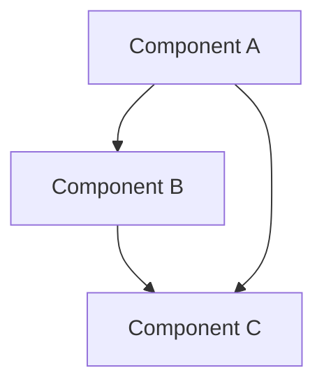
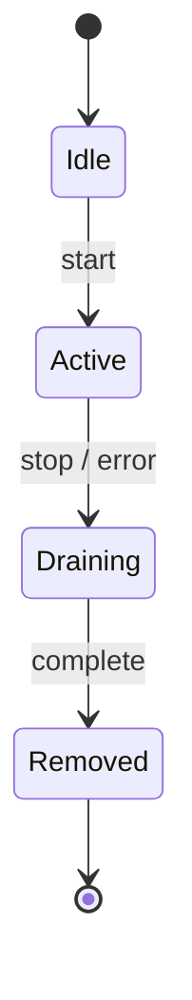
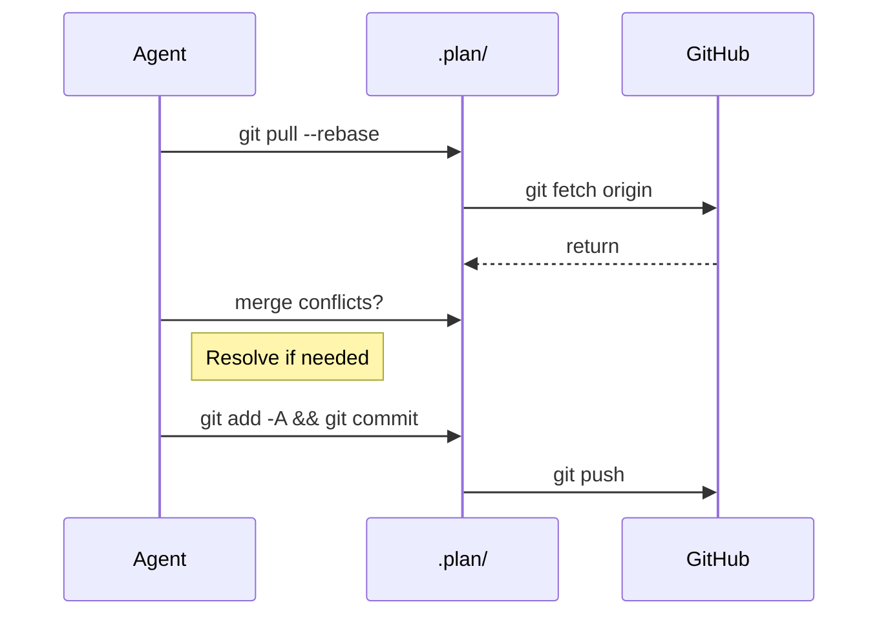
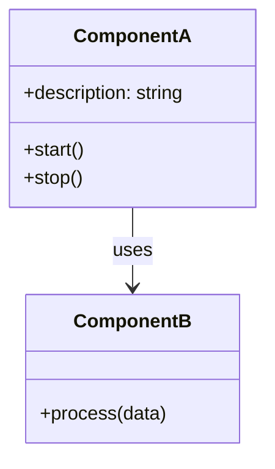
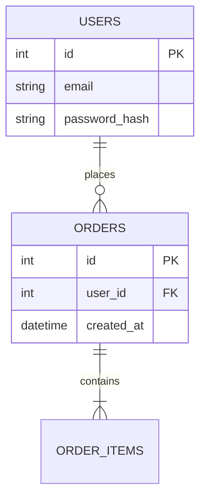
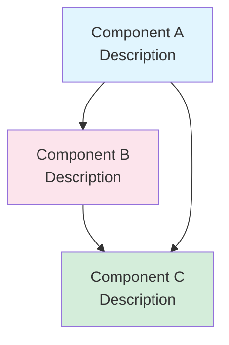
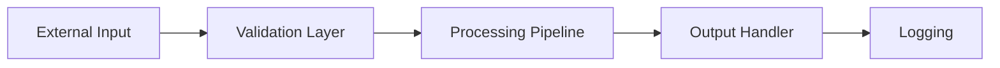
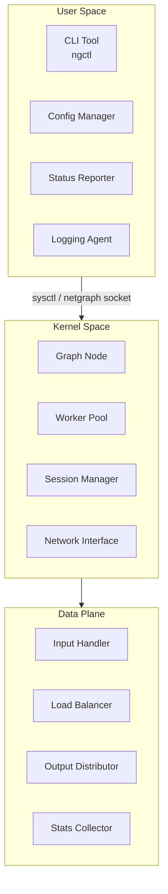
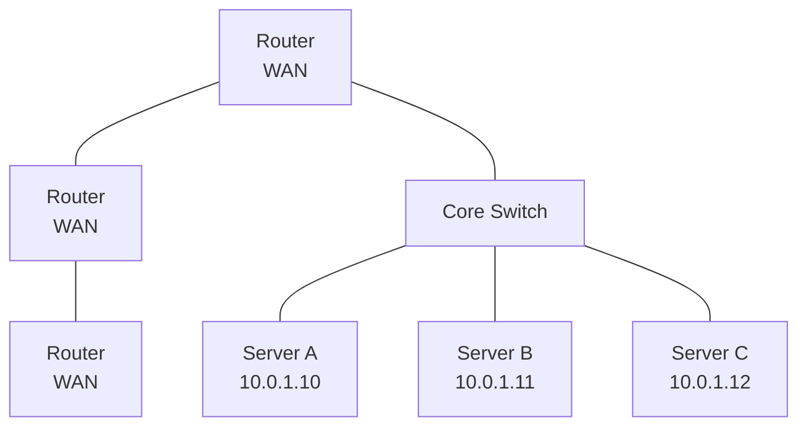
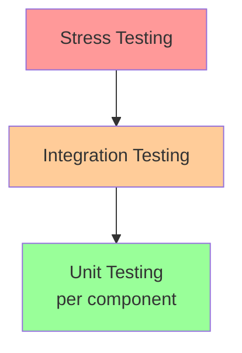

# Skill: mermaid-diagrammer

**Purpose:** Generate architecture, flowchart, sequence, class, ER, and graph diagrams in Mermaid. For UI design and prototyping (wireframes, mockups, screens), produce or edit in-repo SVG files. Mermaid is THE diagramming format for CloudBSD architecture and documentation. SVG is additionally allowed for UI design only — never replace Mermaid with SVG for architecture.

**Triggers:** When writing architecture documents (200 series), creating component diagrams, drawing state machines, or producing UI wireframes/mockups.

## Law

- **Mermaid** (`` ```mermaid `` fences) is THE diagramming format for architecture, flowcharts, sequence diagrams, graphs, and docs.
- **SVG** is additionally allowed for UI design and prototyping (wireframes, mockups, screens). Keep SVG in-repo as `.svg` files.
- **ASCII art diagrams are forbidden.** Do not produce them. Do not teach `+---+` boxes. Convert leftover ASCII to Mermaid (architecture) or SVG (UI).
- **DOT** (`digraph`, `graph {`) and **PlantUML** (`@startuml`) stay deprecated. Do not resurrect them.

## Loading Instructions

Load this skill when the user asks you to:

- Create an architecture diagram
- Draw a state machine
- Illustrate component interactions
- Create a flow diagram
- Generate any technical diagram (use Mermaid)
- Produce or edit a UI wireframe, mockup, or screen (use SVG)

## Mermaid Diagram Types

### Flowchart (Graph)


### State Diagram


### Sequence Diagram


### Class Diagram


### ER Diagram (Entity Relationship)


## Diagram Templates

### Component Diagram Template


### Data Flow Diagram


### Layered Architecture


### Network Topology


### Test Pyramid


## UI design and prototyping: SVG

When the task is a **wireframe, mockup, or screen**:

- Produce or edit a `.svg` file in the repository (do not inline ASCII boxes).
- Keep artifacts next to the feature they describe (for example `docs/ui/wireframes/<screen>.svg`).
- Do **not** use Mermaid for pixel-layout UI screens.
- Do **not** use SVG for architecture, flowcharts, sequence diagrams, or graphs — those stay Mermaid.
- The live CloudBSD web UI is the Angular + Tailwind application; SVG is for design and prototyping only.

Minimal layout wireframe:

```svg
<svg xmlns="http://www.w3.org/2000/svg" viewBox="0 0 800 480" width="800" height="480" role="img" aria-label="Layout wireframe: header, content, footer">
  <rect x="8" y="8" width="784" height="464" fill="#ffffff" stroke="#333333" stroke-width="2"/>
  <rect x="8" y="8" width="784" height="56" fill="#eeeeee" stroke="#333333" stroke-width="2"/>
  <text x="400" y="42" text-anchor="middle" font-family="sans-serif" font-size="18">HEADER</text>
  <text x="400" y="250" text-anchor="middle" font-family="sans-serif" font-size="18">CONTENT</text>
  <rect x="8" y="416" width="784" height="56" fill="#eeeeee" stroke="#333333" stroke-width="2"/>
  <text x="400" y="450" text-anchor="middle" font-family="sans-serif" font-size="18">FOOTER</text>
</svg>
```

A checked-in example: `SKILLS/analysis/ui-analysis/ui-ux-analyzer/examples/layout-grid.svg`.

For UI-UX analysis templates (forms, tables, modals, sidebars), load `SKILLS/analysis/ui-analysis/ui-ux-analyzer/wireframing.md`.

## Forbidden

- ASCII art diagrams (`+---+`, `|   |`, box-drawing trees used as architecture or UI mockups)
- DOT (`digraph`, `graph {`)
- PlantUML (`@startuml`)
- Replacing Mermaid architecture diagrams with SVG

If you find leftover ASCII art, convert architecture/flow to Mermaid and UI mockups to SVG. Never produce new ASCII diagrams.

## Validation Checklist

- [ ] Architecture, flow, sequence, class, ER, and graph diagrams use valid Mermaid (test at https://mermaid.live)
- [ ] Mermaid diagrams are wrapped in a ` ```mermaid ` code block
- [ ] Nodes have descriptive labels (use `<br/>` for line breaks)
- [ ] Arrows indicate direction of flow or dependency (`-->`, `-.->`, `-->>`)
- [ ] UI wireframes/mockups/screens are in-repo `.svg` files, not ASCII and not Mermaid
- [ ] No ASCII art diagrams
- [ ] No DOT or PlantUML

## Mermaid Syntax Cheat Sheet

| Syntax | Meaning |
|---------|---------|
| `graph TD` | Top-down graph |
| `graph LR` | Left-right graph |
| `A[Label]` | Node with text |
| `A-->B` | Arrow connection |
| `A---B` | Line without arrow |
| `A-.->B` | Dotted arrow |
| `style A fill:#color` | Node styling |
| `subgraph Name["Label"]` | Group nodes |

## Reference

- [Mermaid Official Docs](https://mermaid.js.org/)
- [Mermaid Live Editor](https://mermaid.live/)
- CloudBSD Planning/PLANNING.md Chapter 8 (Diagram Conventions)
- CloudBSD Web User Interfaces/WEBUI.md (SVG for UI prototyping)
